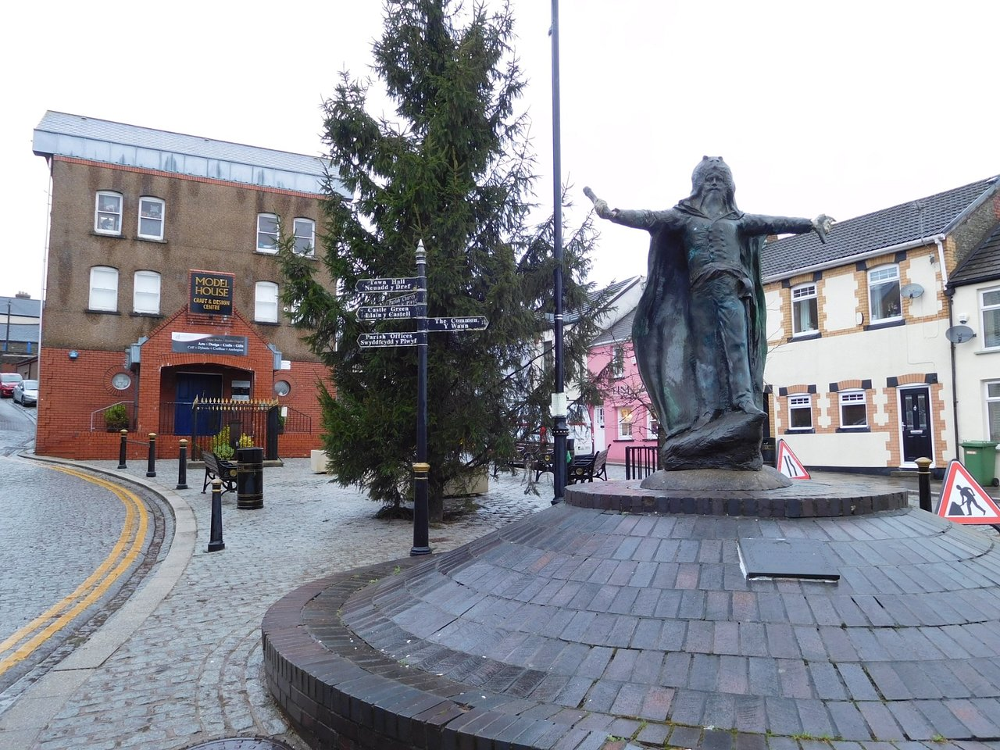

 Llantrisant, a hill town in the South Wales coal-mining country where the Jollow family settled.

The Jollow branch, traced primarily through Marry Ann Jollow (b. 1837, Devon, England),
who married Charles Stone and emigrated to the coal-mining communities of South Wales.
