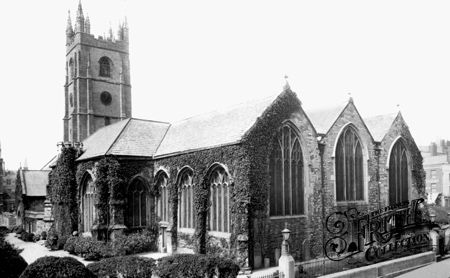
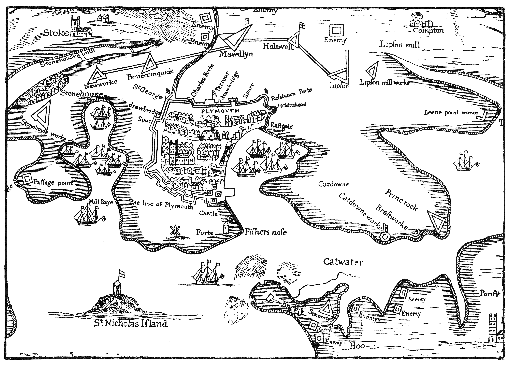
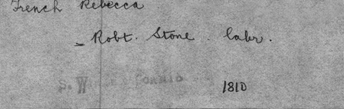
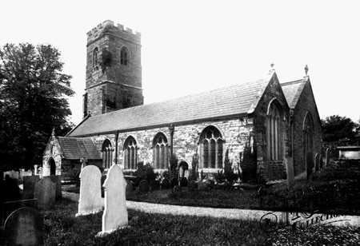

## Stone Heritage

 St. Andrews Church 1889 Plymouth Devon England
The Stone family Heritage starts in Plymouth England, at least as far back as I'm able to gather.
We find ourselves at the city's oldest church St Andrew's (Anglican) which is located at the top of Royal Parade, it is the largest parish church in Devon and has been a site of gathering since 800 AD.
Plymouth England is the birth place of **William Stone - (abt 1725)** he was married to **Jane** on 17 Oct 1750. They had 6 children, Jane Stone - 11 June 1749, Eliza Stone - 16 Feb 1752, **William Stone - 21 July 1754**, Thomas Stone - 05 Dec 1756, Mary Stone - 22 May 1759, and Samuel Stone - 20 Nov 1765. These may be the Christening dates rather than actual birth days since they were found through St Andrew's, Plymouth, Devon Parish registers.
 A map of Plymouth Devon England 1643. Notice Stonehouse to the left. I wonder if that's where our name originated from.
In the 1720s Daniel Defoe wrote: "Plymouth is a town of consideration and of great importance to the public. It is situated between 2 very large inlets of the sea and in the bottom of a large bay, which is very remarkable".
Plymouth became a very important place in the 17th and 18th century creating Docks for building ships. The 1st dock was built in 1689, perhaps that's what drew the William Stone and Jane families to Plymouth. The 2nd Dock was built around the the time of their 3rd child William Stones birth in 1727, the 3rd dock was built a couple of years after Mary Stone was born in 1762 and the 4th dock was built in 1798 when **William Stone - 21 July 1754** and **Mary Thomas - (abt 1760)** were raising there 8 year old son **[Robert Stone](/people/robert-stone/) - (abt 1785)**
It must have been hard living in those days. There were food riots all throughout England in the late 1790's a large amount of bad crops due to horrid weather caused the price of food to rise, but the pay had remained practically the same since the early 1700's. They made, 1 shilling 4 pence per day, to give you an idea of how little that is, 12 pence = 1 shilling and 20 shillings = 1 pound. They barely made over 1 pound a month. So when the famine came along I assume that Robert Stone headed west moving from Plymouth Devon England and going to St. Winnow Cornwall England.

## St. Winnow Cornwall England

 Wedding Registry of Robert Stone and Rebecca French 1810
St. Winnow Cornwall England is the Place that we find Robert Stone who at some point before 1810 left Plymouth and met a girl. When Robert Stone was about 25 years old he married **Rebecca Jane French - 12 April 1784**, they were married at St Winnow Church Devon England on 13 Oct 1810. Unfortunately the honeymoon must have been cut short by the passing of Roberts Father William Stone on the 25th of April 1810 in most likely Plymouth England. I wonder if he was able to be at the wedding and see his son on one of the happiest days of his life, becoming a man and beginning his own family.
 This is the Church that Robert Stone and Rebbeca French were married and the children were christened.
Robert Stone and Rebecca French had 7 children in total, their 1st Son **[William Henry Stone](/people/william-h-stone/) - 29th Dec 1811** born just 8 months and 16 days after the wedding. You get the sense that they were probably a close family and the passing of his father was still prevalent to him. Out of love, respect or perhaps tradition William was named after his Grandfather who he would never get get a chance to meet. They then had a daughter Ann Stone - 31 Oct 1813, Mary Stone - 18 Aug 1816, Betsey Stone - (abt) 1817 but unfortunately she passed away at just about a year old on 03 Feb 1818, James Stone - 08 Aug 1819, Robert Francis Stone - 06 Oct 1822 and John Stone - 17 Oct 1824.
The Stone branches stretch out far and wide, so this is where we will end this section in order to explore the leaves on this family tree a little bit closer. If you have any information, photos, videos or stories that you would like to share with the family please contact us [**HERE**](/people/contact/). Thank you
