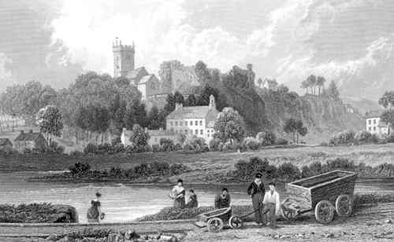
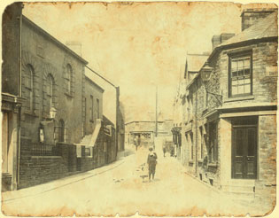
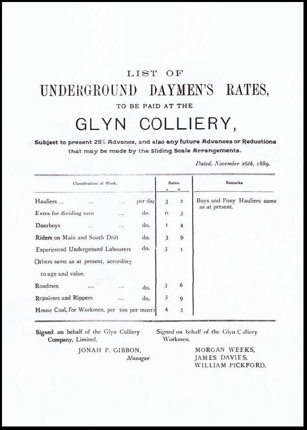
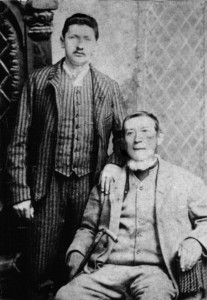
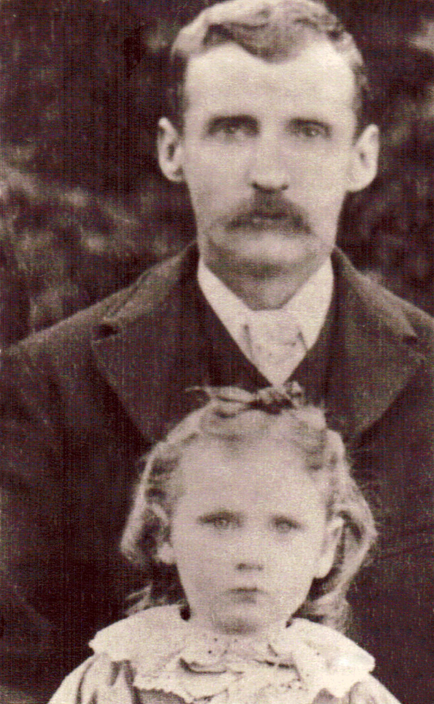
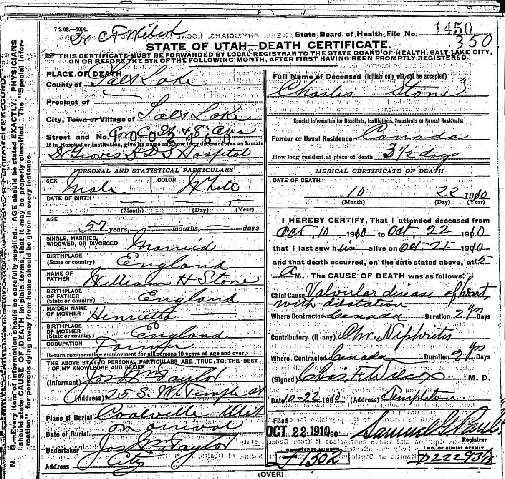
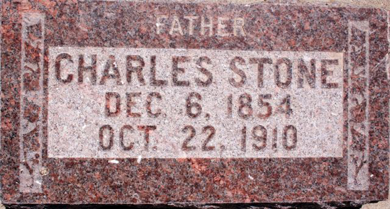

 Bridgend, Cornwall England 1830's by Henry G. Gastineau
Charles Stone was the 10th child born out of the 14 children of **[William H. Stone](/people/william-h-stone/)**and **Henrietta Dennis.** He was born in Bridgend, Cornwall England on the 06th of Dec 1854.
*I will be organizing and adding to this post soon.*
Here's a Biography done by one of his sons.

## History of Charles Stone Written by Richard John Stone

Charles Stone was born on the 6th day of December 1854 at Bridgend, Cornwall England. He was the tenth child of William Stone and Henrietta Dennis. In Dec 1863, the family was stricken with typhoid fever from which four members died. **Robert Francis** 18, **Henrietta** 7, **Rebecca** 22, and the mother **Henrietta Dennis** 47. At this time Charles and **St. Clair** (Augustine) were lying in the same bed together with typhoid when their father, William Stone, came into the room and said to St. Clair, *"I  will buy you an overcoat when you get well."* Charles spoke up and said *"Dad, will you buy me an overcoat too?"* His father said, *"We will see."* Charles thought to himself, *"You expect me to die, but I won't die."*Both boys got well. I do not know if either got an overcoat. This was in February 1864.
 Llantrisant Glamorgan Wales 1905
In the year 1865, William Stone married (Kate) **Catherine Hancock**. She had one daughter named **Henrietta Hancock**, about 9 years old. In 1865 the family moved from Bridgend, Cornwall England to Llantrisant, Glamorgan Wales where all the male members of the family went to work in the iron mines. Which were a mile and a half south of town. Charles Stone was about 10 years old then. Charles worked in the mine until he was about 22 years old (1877) when he and his brother (Augustine) St. Clair left home and went to America and worked in the coal mines of Pennsylvania. Charles did not stay there very long. he said the wages were about the same as it was in the mines near Llantrisant, $1.25 or 5 shillings a day, so he returned to Wales and went to work in the [coal mines](http://www.welshcoalmines.co.uk/index.html) called the
 Glyn Colliery Flyer
[Glyn Colliery](http://industrialgwent.co.uk/pontypool/aglynvalleygallery.htm#glyntillery). St. Clair Stayed in the United States and in time he traveled west and landed in Nevada where St. Clair and another man went into the Saloon business. How long they were in business I do not know. In the Spring of 1899 St. Clair and his partner quarreled and his partner took a gun and shot and killed St. Clair. I don't know the name of the town they were in. St. Clair never married.

In November 1879 Charles Stone and **Mary Ann Jollow** got married in a chapel in the town of Pontypridd, about 7 miles north of Llantrisant. Pontypridd was a much larger town than Llantrisant. They made their home in Llantrisant and lived in 4 different houses, not very far from each other. In the last house, they lived for over 14 years paying rent of about 8 shillings a month, equal to $2.00 then.
Granddad (Charles Stones Father) William Stone died in January 1885. I (Richard John Stone) was about 3 years old. He was about 5' 8" tall and weighed about 140 lbs.
William and Kate Stone's Oldest son
**Frank Stone** was born on the 13th of August 1866 and was about 18 years old when his father died. Dad (Charles Stone) would be 30 years old. Two of William and Kates daughters when aged 4 and 6 went to Bridgend with their mother. While there, the girls became ill, which resulted in their death. Bessie Stone, the youngest daughter, would have been about 8 years old when her father died.
Charles's half-brother Frank, worked in the coal mine with Charles part of the time and kept the family until he got married. He married Mabel Reese and they were the parents of 10 children. All of whom got married and Frank wrote and said they lived within a radius of five miles of his home. Soon after Frank got married he went into the grocery business and made a good living for his family. His wife died in 1929 and he died in 1946 near 80 years old. He joined a church called the United Brethren. So far as I knew he did not smoke tobacco or drink any liquor.

## The Mormons

My Father (Charles Stone) was a member of the Methodist Church and he had some of us children christened there. Then in 1887 or 1888 he went to a Presbyterian church. I (Robert) can remember going with him a few times. In the year 1888 or 1889 he went to the home of a man named Thomas Williams who lived close to where we were living and there were two Mormon missionaries there and some one came and told my mother of it. She became frantic and she immediately went to the house followed by us kids and she picked up two rocks in her hands and called to my father to come out of that house or she would throw these rocks through the window. Dad came out and walked home with us. Not long after this he came home to announce that he had invited the two Mormons to call on us at 7pm. My mother said that she would lock the door and not let them in, etc. However when 7pm came, a knock came at the door and dad went and invited the Mormons into the kitchen. They came in sat down and talked to us for about 2 hours. At about 9pm they got up to leave and mother said to them, "Call again, you are welcome to call anytime." Prior to this time my folks had been taught to believe that the Mormons were men to be shunned and kept away from. My father had done this, but one day as he was walking along the street in Pontypridd, two Mormon missionaries were holding a street meeting. He heard men heckling and calling them names, etc. and the Elder who was speaking said to the crowd, "All we ask of you is to give us a fair hearing." As my father walked along he thought on what was said, and thought we would stop and listen to them sometime. When the Mormons came to Llantrisant they caused quite a stir. But my father decided he would go and listen to what they had to say with the above results. Dad said he got to know that these Mormons had the true gospel of Jesus Christ three months before he join the Church, as he so testified to some of his friends as he talked to them before he was baptized.

The names of the two missionaries were Thomas Griffiths age 62 and [John D. Evans](http://welshmormon.byu.edu/Immigrant_View.aspx?id=560) about 53. Both were Welsh men born in Wales and had lived many years in Utah and Idaho before filling this mission. Thomas Griffiths soon returned to Utah as he had filled a two year mission. John D. Evans made several calls at our home before returning to Idaho Falls, his hometown. Dad was baptized by Elder John Jones 29 May 1889 and he was confirmed a member of the Church of Jesus Christ by Elder John D. Evans 9 June 1889.
I (Robert J. Stone) was baptized by John D. Evans on the 12th Nov. 1889 and confirmed on the 13th. Henry St. Clair went to be baptized the same day, but when we got down the river they baptized me 1st and St. Clair said he did not want to be baptized then, so Dad, who was with us said if he didn't want to be baptized, all right. St. Clair and William Charles were baptized 28 June 1891. Mother was baptized on the 3rd Sept 1890 by Charles Stone and confirmed by John D. Evans on Sept. 15th 1890. Our relatives, especially the Jollows, did not take very kindly to our joining the Mormon church. It also caused quite a stir in Llantrisant when Dad was baptized. There were times when we were subject to ridicule.
(originally after Mines)(The men and boys used to walk home in groups and there were many conversations and arguments. Dad was under the necessity of defending Mormonism many times in his conversations with his friends. We listened to them as we walked home and I was surprised at the foolish talk of some of the men against the L.D.S. Church. To write them would take many pages.)

## The Mines

 Charles Stone and His Daughter Alice probably taken around 1895.
In 1893 Dad took St. Clair to work in the coal mine with him and in March 1894 I too began working in the mine. A few months after I started to work in the [Glynn Coal mine](https://maps.google.co.uk/maps?q=loc:51.5894120438453,-3.40835009906798&t=h&z=15), conditions got very unfavorable and Dad quit that mine where we had worked for so many years. He got work at another coal mine called [Llanharran](http://en.wikipedia.org/wiki/Llanharan) about four miles from [Llantrisant](http://en.wikipedia.org/wiki/Llantrisant) where we walked to and from work every day, rain or shine.
When William Charles got old enough to work in the mines, he went to work with Dad, St. Clair and I. In the year 1895-6 Dad went to Johannesburg, South Africa to work in the gold mine, expecting to make money to take all the family to Utah. At that time wages were much higher there than anywhere else in the world. He got a job running a stope and had about 20 Negroes working under his leadership. He directed how and where they would drill their holes to blast out the rock that contained the gold, that had to be crushed and separated. He was paid L50 a month. it was equal to $250.00 which was a big pay in those days. He worked three months and was taken sick with yellow jaundice and he decided to return home. He said that he would be sent to the hospital there and if he had no money to pay, he would be left to die. He arrived home and found Mother in bed with a baby girl (Lucy) who was just born.
While Dad was away I (Richard John Stone) worked in the Tin Factory there, William Charles worked in a sawmill and St. Clair worked in a Coal mine. In 1896 there was a coal miners strike of five months. The strike was called for increased pay for the coal miners. William and I continued to work all this time. The coal miners union of England came to the aid of the Welsh miners and sent them money every week. A few shillings a week, which helped to buy food for their families. After the strike was over the Welsh coal miners joined the Coal miners union of England. St. Clair and Dad went back to work in the mines, when dad had saved enough money he quit and left in 1898. I quit my job in the Tin Factory and started working in the mines with St. Clair. The tin factory had two divisions, one where they rolled out the sheets of steel and the other, where they covered it with tin. I worked in the latter division, and a few days after I left the tin factory the foreman, George Jacobs was his name, and the foreman, called at our home to try and persuade me an advanced job with increased pay; but because we were preparing to come to Utah, I did not return but continued to mine coal. We also took Fred with us and when St. Clair left to come to Utah, Fred and I continued to work together mining coal until we left to come to Utah August 29, 1900.
Dad went to Eureka in Juab county (Utah) and worked for Jesse Knight in his Humbug mine at $2.75 a day in six days a week. The other mines worked 7 days a week at $2.50 per day. Jesse Knight's mine was the only one to close on Sundays. Dad continued to work there until St. Clair came there. St. Clair could not get work there so dad wrote to Joe Wilde of Coalville who got them work at the Grass Creek coal mine about 8 miles out of Coalville. So they both moved there. In the summertime, they only worked 2 or 3 days a week, so they had a lot of spare time on their hands. While we all lived in Llantrisant we older boys went to many places with dad. We went walking on the hillside, especially on Sunday. We had no church to go to of L.D.S. Once in a while we boys would go to other churches. The church of England, Methodist, etc. Men of the Methodist Church would hold a street meeting on a square below where we lived. We used to stand by the garden wall and listen to them. Also, the Salvation Army would hold meetings there too. In the summertime, the men of the Methodist Church would form a band. Each would have an instrument to play and they would walk to a square on the Crag close by and play the band and hold a service there. They came there dressed in their white shirts. We used to follow them. It was only about 5 minute's walk to the square. We used to walk in the Smile loge Mountains close by on Sundays and Holidays. When we got home mother would have a cooked dinner waiting for us. We would be very hungry after our walk.

### Cause of Death

I (James Stone)  interviewed my grandfather (Ivor Stone) and recorded it on cassette tape before he died. Here's a transcript of the recording:
**Ivor was about 9 years old in 1910**
Dad was sick. Glen and I, we had to herd the cattle and help with the horses, but the girls, they did all of the milking. The rest of my brothers were in Utah and up in
British Columbia. During that time, our brothers were living in Fernie, British Columbia. There was a big forest fire. The smoke was so thick in Fernie that you couldn’t breathe and they had to move to different places. They would get in the river and have to duck their heads down in the river. And my brother was a photographer, and he had to put all of his stuff down in the well. He kept it alright, but some of the people that went down in the well, their heads were cooked, because they couldn’t keep cool, The heat from the fire was so hot.
Fernie, in British Columbia, is about 100 miles away from Raymond, I guess. But the smoke was so bad you could hardly breathe. And they had a train taking the people out, and the train caught fire from the heat. And this is what the boys told us about it. It was a bad situation.
Anyway, when dad was getting pretty sick and decided to go to Utah and take us all through the temple. We came down on the train. I can’t remember how long it took us, but it took several hours. I think probably a night and a day to come down. When we got into Pocatello, this was the center where they had a lot of engines. There was so much smoke from all the train engines you couldn’t even see the town or anything.
Then we arrived in Salt Lake and they had a fair in Salt Lake at that time. We went to the fair and they had an airplane and they were trying to get this airplane off the ground. It was like a bicycle, it had bicycle wheels and the fellow driving the airplane, he would sit right out in front and they would get that airplane going and they would get it up, oh, maybe 3-400 feet, and they would go about 3 or 4 blocks and come down with a bang.
Dad was really in bad condition. He hadn’t been able to work for quite some time. He joined the church in England, or in Whales rather. And mother wouldn’t join for a long time, she was mad at him. But finally, she joined. So then they came here and in about 1910 they decided they would come down to Utah and go through the temple. So they took us four kids, Jean, Laurie, Ivor, and Glen. And then Alf happened to show up at that time and so he went through the temple with us. Dad was sick and he had to go to a hospital. When he was ready to go, they took him in a car. When he got in the car he said, “when I come out I’m going to buy me one of these.” There were very few cars at that time.
Instead of staying in Salt Lake, mother took us and we went up to Grass Creek. That was 6 miles east of Coleville. Dad died while he was in the hospital. I don’t exactly know what he died of. They said it was Bights disease, but all the time he was sick his nose bleed. I believe that he bleed to death, practically. He just kept getting weaker and weaker all of the time. *(note from James Stone: he died of [Valvular heart disease,](https://www.medicalnewstoday.com/articles/valvular-heart-disease) which today would be treated with medication or surgery.)*
My mother went to [Grass Creek](https://en.wikipedia.org/wiki/Grass_Creek,_Utah) with us kids and while she was there Fred, that’s one of the older boys, became sick up in Wyoming and he came to Grass Creek. They put him to bed. He had Typhoid fever. Let’s see, Glen and Laurie caught it. And Ethyl, my older sister caught it, and she died with it. Glen and Laurie had it really bad. I can remember when Ethyl had it – she kept saying – “I want, I want, a piece of bread and butter…I want, I want, a piece of bread and butter.” And that used to worry me a lot. …Apparently, we didn’t get it. Anyway, we had to move into another house, to keep us away from catching the fever. I think I was about 9 years old at the time, I think we were in Grass Creek in 1910 then we moved to Scofield. We lived in Grass Creek after dad died. Grass creek is about six miles east, there’s nothing there anymore, it was six miles east of Coleville.
Charles is buried in the Coalville cemetery.

