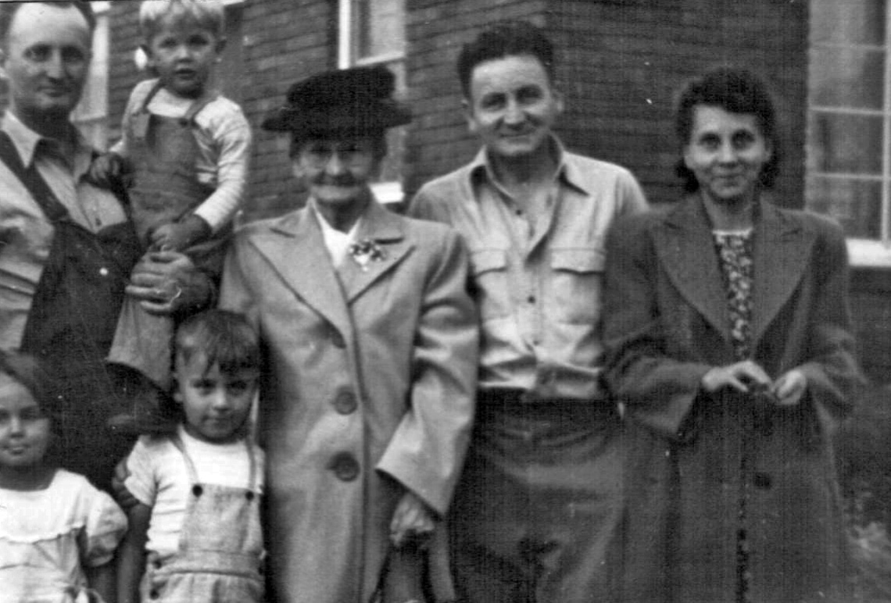
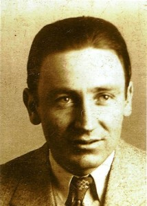
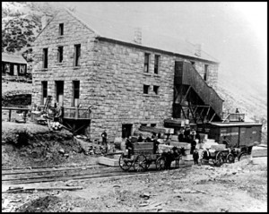
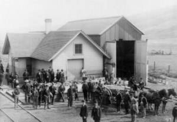
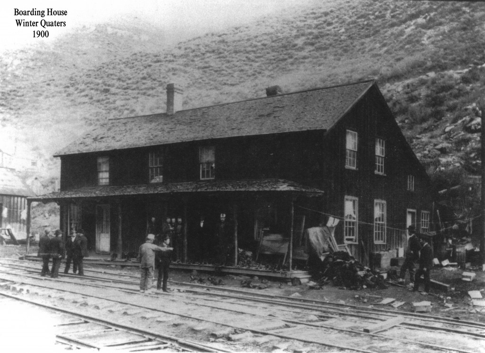
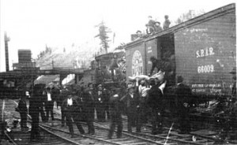
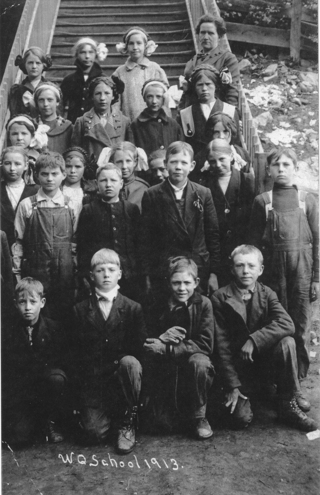
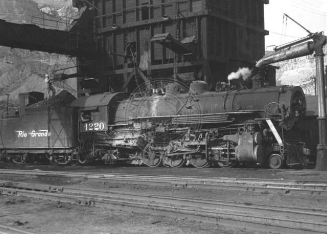
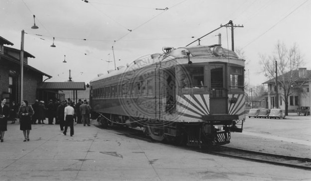

## Ivor Stone

Ivor Tudor Stone was the 11th child born out of the 13 children [Charles Stone](/people/charles-stone/ "Charles Stone") and [Mary Ann Jollow](/people/marry-ann-jollow/ "Marry Ann Jollow") had.  He was born in Grass Creek Summit County Utah on July 12, 1901.  Married to Eleanor Verdell Billingsley.  He and his wife had three children.  Ivor Lee Stone, Joyce Rena Stone, and Donald Jay Stone.
 Lawrence Stone, holding his son David, Mary Ann Jollow; Ivor Stone and wife 'Nellie' Eleanor. In front, Elva Lucille Stone, and Donald Stone son of Ivor and Nellie.

## History of Ivor Stone

### Captured from tape recordings by his Grandson James Stone

*(the audio tapes will also be uploaded on this site once digitized)*
**Introduction**
My folks (Charles and Mary Ann) came from Whales. They were originally from Cornwall England, in fact all the Stones dating back to the1700s were from Cornwall. Later they moved up to Whales. My dad, and my brothers, came over from Whales in about 1889. Mother came with the children in about 1900. I was born in 1901 in Grass Creek, Utah. July 12, 1901.
**Canada 1909ish**
We moved from Grass creek to Raymond, Alberta Canada. The first thing I can remember in Canada is when they were building our house and they were putting the roof on. We lived in a dug out - that is a hole in the ground with a roof over the top. My folks homesteaded property. We owned 280 acres of hay land, 200 acres of beat land under cultivation. They had two city lots, each one of them was an acre each. They had a big barn - enough to hold 32 head of cattle, 8 head of horses and they had a lot of farm implements. And my dad, in addition to farming, he herded the town cows. There were about 600 cows. He (dad) became sick and I was around 8 or 9 years old and I had to go and help with the cows: we’d pick these cows up in the morning and take them out to the fields and keep them all day and bring them back in the evening. Glen and I was doing the work...
**The Old Mine**

One day we went to what they call the St. Mary’s riverfor a holiday. While we were out there, dad decided to go through an old mine. He took me with him and told me to wait outside. Well, I  didn’t wait, I got tired. So I took off and started going in the wrong direction. It’s a good thing that dad came out soon after because I was about a mile away and going in the wrong direction. He got mad at me for leaving...
**The Cows**
When I was about nine, I used to have a white horse that I rode all of the time and we had a little roam horse. He was a cow pony. We’d start the cows out and we would let the cow pony drive them. We had a little shepherd dog. Between the dog and the horse, they would herd the cows and keep them moving. Glen and I, we’d play along the way - marbles or whatever we would come to. One day, why, on the way out we decided to go through some water because there was a lot of ducks and geese in there and we used to play with the shells and things. On this morning, we went through the swamps and on the way through I was sitting on the back holding the gun. I would shoot squirrels and things on the way. The horse shied and I fell off into the water. It was
about waist deep. I got up and walked out, but I had to go back and get the gun...
We would play under a bridge. One morning, why, we were playing under the bridge and an old Indian came along and he said, “boy’s come here, you’re cows are going home.” So we got out from under the bridge and some of the cows were started for home so we had to get on our horses and catch up with those cows and bring them back.
One day we were out there and dad, he brought a mower to mow the hay. And he had Glen driving. One of the cows started to go home so I had to run down to see if I could get the cow. I got  turned around and was headed back, there was a narrow lane, and I looked up and saw that Glen’s horses had run away with the mower. So I got off, tied my horse up to the post, and jumped on the other side of the fence. As the horses went by they hit the post and broke the mower off.
Another time I was taking the cows back home, there was a bridge across the canal and we used to have such a bad time there. We would take part of the cows to the east side and
part to the west side of the bridge. One of us would get on the other side of the bridge and divide them this way, as we drove them by the houses the cows would automatically go
home. One day I was racing glen and my horse’s foot hit a culvert and threw me off against the telephone pole and knocked me out. When I woke up mother and dad was there,
but all it did is knock me out - I was alright after.
We would ride the horses and sometimes we would try to ride the cows. Sometimes they would buck. We wasn’t very good at it.
**The Turkey’s**
One time dad bought an incubator and a blow dryer. The incubator was to hatch the eggs and the rotor was to keep them warm after they hatched out. One day the wind was a
blowen and it set them both on fire and they burned up. The little Turkey’s got loose and went out into the grain and we didn’t know what happened to them. Anyway, that fall
they came out and there were several dozen mature Turkey’s. So, we didn’t lose very many of them. We would usually sell the Turkey’s. Anyway, it seemed like we would accumulate a lot of turkeys  and then they would cut their throats and hang them up at the end of the year and then they would pluck them and sell them to the butcher.
**Beat Fields**
We used to go out to the beat fields to help and dad would hire Indians to top beats. The Indians would come there and the squaw would be leading the horses. They had the old buck they called him, they call him a buck, ol’ buck. He’d ride and they would put a pole on each side of the horse and they would tie it so it would pack like a saddle and they would tie it at the bottom with a blanket. The ol’ buck would sit on the blanket and they would drag the old man in that. When they got to the beat field, the buck (the old man) he’d take the blanket off and build a fire, and
sit by the fire. The woman, (squaw they called them) would go down and top the beats. When they got through,why, he would get back on this, shabs, or whatever you would call
it and he would ride home.
One day we left, and I can’t remember why, we tried to go through the river. The river entered the lake and for some reason or another, we tried to cross. Instead of going across by the river, we went out to the edge of the lake. The bottom of the river had dredged out like a canal. So, we went with the team and the front wheels dropped down into the dredged out part of the river. The hitch the horse is attached too, is only a bolt, and it came out, and the horses run on across the river and dunked the wagon in the river. So dad had to get out and attach the chain to the wagon and pull the wagon through, we went home from there.
**Wildlife in Canada**
There were a lot of fish. I used to like to go fishing. We would catch them. They would build dams and the fish would try to jump across the dams and would get stuck on the tops and all you had to do is go and pick them up. There were a lot of geese and they would fly over, it was just like a cloud. We used to take a .22 and just point it up and bang!
And there was a lot of, kit foxes, they called them. This is the fun that we would have. We’d pour water down the hole and when they would come out we’d grab them by the back of the neck. If you  got a hold of them the wrong way they would bite. But you grab them by the back of the neck and hold them so they can’t turn their head, and they are small. I can’t remember what we used to do with them. But one day we were driving home and there were a lot of coyotes and these coyotes would come up close to us. And we had dogs. And when they (coyotes) would get pretty close we would set the dogs after them. The dogs would run after them and they would chase them just until they were out of sight and then they (coyotes) would turn around and chase the dogs back.
One night we was coming home form what they called “the good hill” we saw a big animal over there so we had to see what it was. When we got closer we could see that is was a big wolf. It didn’t bother us.
On time went over to the graveyard and the Chinese would bury their dead and leave their lunch on top of the grave for the spirit to eat. We used to see if it was any good.
**The Kids**
Dad was sick. Glen and I, we had to herd the cattle and help with the horses, but the girls, they did all of the milking. The rest of my brothers were in Utah and up in
British Columbia. During that time, our brothers were living in Fernie, British Columbia. There was a big forest fire. The smoke was so thick in Frenie that you couldn’t
hardly breathe and they had to move to different places. They would get in the river and have to duck their heads down in the river. Any my brother was a photographer, and
he had to put all of his stuff down in the well. He kept it alright, but some of the people that went down in the well, their heads were cooked, because they couldn’t keep cool,
The heat from the heat from the fire was so hot.
Fernie, in British Columbia, is about 100 miles away from Raymond, I guess. But the smoke was so bad you couldn’t hardly breath. And they had a train taking the people out, and the train caught fire from the heat. And this is what the boys told us about it. It was a bad situation.
**Ivor in Utah 1910**
Anyway, when dad was getting pretty sick and decided to go to Utah and take us all through the temple. We came down on the train. I can’t remember how long it took us, but it
took several hours. I think probably a night and a day to come down. When we got into Pocatello, this was the central where they had a lot of engines. There was so much smoke
from all the train engines you couldn’t even see the town or anything.
Then we arrived in Salt Lake and they had a fair in Salt Lake at that time. We went to the fair and they had an airplane and they were trying to get this airplane off the ground. It was like a bicycle, it had bicycle wheels and the fellow driving the airplane, he would sit right out in front and they would get that airplane going and they would get it up, oh, maybe 3-400 feet and they would go about 3 or 4 blocks and come down with a bang.
Dad was really in bad condition. He hadn’t been able to work for quite some time. He joined the church in England, or in Whales rather. And mother wouldn’t join for a long time, she was mad at him. But finally she joined. So then they came here and in about 1910 they decided they would come down to Utah and go through the temple. So they took us four kids, Jean, Laurie, Ivor and Glen. And then Alf happened to show up at that time and so he went through the temple with us. Dad was sick and he had to go to a hospital. When he was ready to go, they took him in a car.
When he got in the car he said, “when I come out I’m going to buy me one of these.” There were very few cars at that time.
Instead of staying in Salt Lake, mother took us and we went up to Grass Creek. That was 6 miles east of Coleville. Dad died while he was in the hospital. I don’t exactly know what he died of. They said it was Bryce disease, but all the time he was sick his nose bleed. I believe that he bleed to death, practically. He just kept getting weaker and weaker all of the time.
My mother went to Grass Creek with us kids and while she was there Fred, that’s one of the older boys, became sick up in Wyoming and he came to Grass Creek. They put him to bed. He had Typhoid fever. Let’s see, Glen and Laurie caught it. And Ethyl, my older sister caught it, and she died with it. Glen and Laurie had it really bad. I can remember when Ethyl had it - she kept saying - “I want, I want, a piece of bread and butter...I want, I want, a piece of bread and butter.” And that used to worry me a lot. ...Apparently we didn’t get it. Anyway, we had to move from, into another house, to keep us away from catching the fever. I think I was about 9 years old at the time, I think we were in Grass Creek during 1910 then we moved to ScoField. We lived in Grass Creek after dad died. Grass creek is about six miles east, there’s nothing there anymore, it was six miles east of Coleville.
**ScoField**
 Wasatch Store, Winter Quarters 1900
After the everyone got better from the Typhoid fever, my older brothers Fred and John went to winter quarters in ScoField to work. And there was Fred up there and John. After they worked there for awhile, they sent for mother so mother come up there and we lived at ScoField. John, he was married at that time, and Fred just got married after he got over his sickness. He lived in winter quarters. So, Alf came up there but our sisters didn’t come up until later about 1912 I guess. That’s when my oldest sister got sick. After we arrived in ScoField my sisters (Lucile and ?) went
to work in a boarding house at one of the mines. Mother went back to Canada to see about the property. She was gone for two years. At ScoField, Lucille, she was the youngest girl. And she took care of us. Glen, he went with my oldest brother to Castlegate to take pictures. He was a photographer and had Glen go with him to help out. So there was the three of us - Gene, Lori and I at home with Lucille. Lucille used to get scared, she was about 15 and took care of all three of us. She used to sit up at night and would make us all sit up with broom sticks to protect ourselves. It was her boyfriend teasing us trying to scare her. We’d be sitting there and she would go to sleep and he would go, “Wake up, wake up!”
Lucille took care of us for two years while my mother went to Canada to take care of our property and sell it off. Alf was working with the Utah line. He would come home every night. He was the one that kept us. He worked in the mine and supported the house. Alf brought the money home and turned it over to Lucille and she...mother she was not one to say money. One morning I got up and had to...Lucille had made some cereal and so I had to wash the dishes. And I went to clean out this cereal pot and when I got out there, there were silver dollars in the pot. Mother had put money in the cereal.
I would sit around on the West South part of the house where it was warm, because even in the summer time in ScoField it was cold. I used to have a nose bleed a lot. Sometimes I would get so weak I couldn’t hardly walk around.
**Freezing**
 Scofield
When my mother came back we moved to winter quarters and mother took over the boarding house. My job was to...well, first when we went to winter quarters we would clean the church. One night I would go up to clean the church, but most of the time it was left for me to do the cleaning. And I was going to school, but I hadn’t gone to school very much - Because in Canada I was sick - I had pneumonia. It was so cold up there that it would freeze the cattle standing up. When the storms would come up, the cows would get close together and go in circles. The snow would be
maybe two feet deep, three feet deep, whatever it was, they would shove them out in the snow so they couldn’t get back in so they would freeze to death standing up. It was so cold up there one time Alf was coming home and he had these Ear muffs. Coming home they froze to his ears, and froze right on his ears. They had to get them off with cold water. And when it would storm, we was out playing when it would storm - mother would say, “you head for home the minute it starts.” because it gets so cold you would freeze to death.
**Running the Boarding House (Winter Quarters)**
 Boarding House 1900
My mother ran the boarding house and we lived right in it. I had to take care of the fire and they had another addition building for the men. When she first took it, they only had just a few men in this one building. They slept right in that building, but when the war broke out, they had several hundred men, and so they had another building and I had to help. I’d get up in the morning and I would get breakfast ready. I’d cut up the ham or the bacon or whatever it was. And I’d put the coffee on and get the meal prepared for breakfast. Then I’d go back to bed and stay until it was time to go to school. And they would take over and serve breakfast. I’d have to go down to this boarding house, this old building, and I had to take care of the furnace down there and I had to make the beds...get the coal burning stove going, or they kept it going all of the time, burning all the time. They’d bank it during the night and I would go down and clean it, clear it out, and fire itup and get it going again so they could have hot water for when they came home in the evenings so they could take a bath.
They used to go down there and sit around and listen to the fellah talk. This is kind of a funny deal...Now it’s talking about the men. They used to, they call it, they used to send out for beer, and they’d get a bucket. They’d get a few nickels between them and one fellah would go down to get the beer and bring it back. One night, this fellah, he went down to get the beer. There is what they call the cow catchers on the tracks – the beer runner he used the train tracks to get the beer. He fell down in this cow catcher. While he was there he sat down and drank the beer... When he come back he didn’t have any beer - boy were they mad at him... It took all the money they had.
I was taking care of the furnace one night and a fellow came in there and he had been drinking. He kept bothering me and I told him to get out of there. Anyway, he wouldn’t leave so I went to do something. Pretty soon I heard a bang! He got a ladder and tried to crawl up through the ceiling, there was an opening up there, and he fell out... I had a time with him.
 Winter Quarters Train
I would make the beds, part of them, Lucille would come down sometimes and help. Then in the evening after school I would go down and get that fire going so they could take a bath. Then after I got that done, the men would be coming home. So I had to go up and wash the dinner buckets. There was maybe 150-200 dinner buckets. Dinner buckets are what they had their lunch in or their lunch buckets. And I had to wash all of those. After I got through, I would go in and sit around and talk to them. We had a big front room with a big fire - we would go in and sit down and talk to them for a while and then we would go to bed because I had to get up at 4:00 in the morning to get the fire going and to cut up bacon and ham or whatever and then go back to bed. Then my mother and sisters would take over and serve the meals and put the meals and serve it. I would wake up later and go to school. School When I first went up there, I was behind in my school. When I came down from Canada, I hadn’t been to school very much. They had one teacher teaching everybody. And he thought I was a dumbbell and didn’t give me very  much assistance.
Didn’t help me in any way at all. All he did was pick on me because he thought I was a dumbbell. When I first went to ScoField, I went in the third grade and a teacher really took an interest in me. She helped me a lot and I got along fine. Then when I was in the fourth grade, there was this teacher by the name of Harvey, Carol Harvey. And she helped me out a lot. So I was promoted to the fifth grade. So she suggested to the fifth-grade teacher that I should be promoted into the sixth grade. So, when I went to school that year, Ms. McDonald was her name, she put me in the fifth grade. So when I’d slack off she would say halt or I will put you back. Then my work would get all caught up again.
My times tables, this is odd, they had you get up in front of the class and have you do the times tables on the board. I was up there, but I went in the wrong direction...I went to the left instead of the right you see. And I got through before anybody did. She said, “boy you’re the fastest, you’ve done it wrong.” Anyway, why, then I was promoted to the sixth grade. And promoted from the sixth to the seventh. So I took the sixth, seventh and the eighth grade. And before I finished I had to go to work so I just about to the end of the year and I would have got promoted, graduated, but I didn’t make it. So that’s all the education I got. I didn’t quite get through the eighth grade. Then they told mother that she had to move out of the boarding house because she couldn’t take care of these men.
**Sleigh Riding**
Every night we used to go sleigh riding. In the canyon,  there was this hill, about half way up the canyon. And they had a store built up there. This hill was oh, probably, 1500 feet up and it was about 1500-2000 feet long or something like that. Alf or some of them bought us a sleigh that would hold I think six or seven people. It wasn’t a toboggan just a regular flyer that we used to have. We would ride that. And one time, we would take that to school. And one time at noon, we were going to go out for noon. And the sleigh...with snow we crushed it...you see, so you can go along the top. I was riding the front and doing the guiding and everything and it was so crowded they pushed me off. My legs went underneath the sleigh and my arms up over the top like this, and boy, we was going down there 60 miles an hour... But then, the snow was so deep, I went clear to the bottom and I didn’t get hurt. Every night we would go out and go sleigh riding, and this was  before the war.
**Fishing in Scofield**
We used to go fishing down to Pawn town all of the time. And one time, we’d walk from winter quarters from down to Pawn town, which is six miles. And I used to be the fisherman. The rest of the kids, they would play most of the time and wouldn’t catch anything. And there was a little island, I had to crawl in between the trees, (you know how the trees will come together) to get out on the embankments so I could fish. I sat there fishing and there was a tub that had water in it. It was buried in the sand and it had probably three or four inches of water in it. I would catch the fish and put them in there. I don’t remember how many fish I had, but I had that tub...full of fish. So when we’d go, went to the home I would divide it up with the kids. We used to do a lot of things like that.
We’d walk down and go fishing quite often. One time we decided that we were going to have something to eat with us so...there were a lot of sheep up there...so we ...(slaughtered) a sheep between us. So we skinned it and decided we was going to cook it and eat it. So we built a porch like... like a sawhorse, yeah, only it was with sticks that were tied together. And we put this sheep on that and build a fire and we would keep turning it. We did that all night. We was never able to get it cooked... My mother didn’t know where we were that night she never used to pay much attention to us, she had too much to do. I used to go fishing all the time up until I had to go to work. Then I had to go to work.
**Mother was Fired**
They moved my mother out of the boarding house because they had too many miners and she didn’t know how to operate the boarding house with that many men. She tried to feed them too good. She didn’t feed them any beans. This is what was necessary...I learned that since I went out on the Rio Grande railroads where they had a lot of people. And mother tried to feed them T-bone steaks and stuff like that. You’ve got to have stew, beans, potatoes and all kinds of stuff. Initially she had maybe 5 or 6 borders so she could feed them good. So she could feed them good, feed them ham for breakfast and hotcakes and all kinds of stuff. But when the war broke out, then I think she had 200 men. She couldn’t handle it, so they took her out and then I had to go to work.
**Work**
My mother lost her job when I was about 14. I would go up and work in the mines. I would work on what they would call the (tipple.) I didn’t go to school, I should have went to school. I could have some days but I didn’t go and I should have done, but the reason I didn’t go was the pressure. It was the pressure from the kids...I started to go to school but the pressure from the kids, “what you going to school for? You don’t have to go to school!” So this is what stopped me from going to school. I wanted to go to school, but like I say, that pressure stopped me from doing what I
wanted to do - because of the kids. Anyway, we went to work up there and I was working on the tipple. The mining calls, they’re small cars, they’d have about a ton and a half to two ton in each car and you would come down and you would have what you would call a dump. The roads were bent up in sort of a circle like...half of the wheel would fit into that, see. And then the back end would go up and they would dump the coal into this hopper. And then they would bring it back down and they would automatically open and cars would run through and the next ones would come into it. My job was to bring these cars down, cut off a few of them at a time and bring them down to the fellow close to the dump. Then he would release them one at a time to the dumper,
see. I was sitting on the banister, and I turned around and fell off. I fell about 15 feet over backwards and lit down between the empty car tracks and I broke my ribs. I can’t remember how long I was off.
**ScoField Mine Flood**
They had a flood and washed out all of the tracks so I would go to work and be a water boy. Just carry the water around for the men to drink while they was worken. I did that until they got the tracks back in, it washed out all the tracks. What happened was there was Strawberry reservoir (think it’s gooseberry) up above ScoField, at this time, and the reservoir broke and let all that water
down into ScoField. It came down the canyon, down Bishop Canyon. And it just picked the rails and that and set it right over on the hillside. So the trains couldn’t come up and down. So we worked there all one summer, or one year, anyway. I don’t know how long it took us to rebuild that. They would take us down everyday and I would have to get a handcart, ride a handcart down to get the water and bring it back and we would deliver it around and the men would drink while they were working. And anyway, after that was all done with, we were back working, then WW1 war broke out. We had to work over time, Saturdays and Sundays and everything...
**Horse Kicking**
We had to work Saturday and Sunday and Glen and I - they wouldn’t let us have a day off... We told the Foreman we was going to take a day off and because...we figured we was entitled to our rest. They were letting the other fellow’s off - they’d been getting off regular! Anyway, we laid off so they fired us. And then we went down to ScoField. And (Briga Marine) was the foreman or the superintendent, rather, and he took a liking to me for some reason or other. And he gave me a job. He had the railroad cars, they were put on an incline and they were put up like on...up in...of the canyon and we would drop them down. And there was these scales, he’d weigh them and then you would put them on the truck to be loaded. And then when they got loaded you would drop them down and over the scales and re-weigh them again. So you would have the weight, the amount of coal that was in there. So he gave me a job as weigh man, doing that. And then as things went on, his brother, that was working in the office, they had an old horse around there, they just kept him around for nothing. Just because he had worked in the mine for years. And one
day he went outside to do something, I can’t remember what it was, and Briga’s brother Tec slipped on the ice and fell. He fell towards the horse and the horse kicked - caught him in the face and killed him.
 **Keepen the Books**
The next morning I went to work and Briga said, “I’ve got a new job for you.” And I said you have? He say’s “yeah, you’ve got to help me down to the office.” I said, “I don’t know nothing about the office...” And he said, “That’s alright, I’ll teach you.” Now this is how bad it was: Her kids...I was going to work up there one evening and two friends of mine that was there, that I run around with, say’s, “where you going? What you doing, getting in with the office work up there?” And I say’s, “no I’m going up there to learn something.” “What ya learning?” I say’s, “I’m learning how to keep books.” And they laughed and say’s...and made all kinds fun of me. This Verdon Madsen kid he was about two years in college. He come along and he say’s, “what’s the matter Ivor?” And I told him (I was about 16 at the time). Anyway, he jumped all over these kids and said these two kids will never amount to anything. He say’s, “you go out there and learn everything you can.”
Oh Verdon, he was really good to me. I don’t know why...I guess...
That’s where I learned book keeping. I would go up there and I kept the records - I kept the payrolls and kept the shipments of the coal and the costs of the coal and the costs of the operations and all that...he taught me how to do it.
It was a good job but I had to do other work too, see...because the mine wasn’t working full time. Then I’d have to go up and weigh cars. And then I’d work...on the days off I would work in the office - see, because when the mine wouldn’t work regular...anyway, why, in 1920, about 1920...it was earlier than that...somewhere along in there...the miners all went on strike. And so I was working in the office so I could still work, and then I had to haul coal to the people down town. They didn’t have enough work and decided I would have to help down to the mine once in a
while. So I went down to the mine...and I’d never worked down in a mine before. And we was cleaning out what they call a hallway. And because of the dust and stuff like that...dust is explosive...so you had to mix dirt with it, they’d mix dirt with it. And we was cleaning this up and that didn’t bother me too much, but then one day he said, “well you’re going to have to help fix the cave in...” There was this one place partly caved in, and we had to remove all of the debris that was there and put more props up to hold the roof. And I worked in there and it kind of
worried me a lot.
 **Rope Rider**
Anyway, I worked like that, so one morning the superintendent come to go to work and he say’s, “Iver you’re going to have a new job today, you’re going to be rope rider and I’m going to be a hoist man”. These cars see, they’d bring about 18 cars, small cars out of the mine, and run them across a scale and drop them into...dump coal into the tipple...and they’d load it into the cars
with that tipple with what they’d call shakers...they’d shake and divide the coal up. And slack would be in the first car...a little bit larger in the next...and a little bit larger on the next...and on the end would be the big lump, see. And these...have different railroad cars you would dump this into. And then when you would dump it you would push the empty car back. And when you got enough of them you would connect them all together with a big cable...and the cars were on an incline so you would put sticks in them, they call them scrags, in the wheels, to hold them - so they wouldn’t run down. And after you got the cable onto the front end you had about 18 cars you would take the scrags out of them...take the scrags out of the wheels... and they would drop down into the tunnel. So you would get a hold of the front of the car like this...stick one foot on this cable and one foot on the car...and they would let you down into the mines... And so we would decide to have fun...and so he let me go down there at 90 miles an hour... (Oh no!) Yeah...that did it...They would go down there and there was a phone there...boy, I’ll tell you what... And he sits there and he laughed...
**Strike Breakers**
Anyway, why, I quit and, of course they was having these strikes. And they had strike breakers - they would bring men in. They didn’t have automobiles in those days - they’d bring them by the train and they would haul them up to the mines in a buggy. And they would have guards...about 5 or 6 guards...meet the trains and then the men would meet the trains...5 or 600 men...we’d be down there...this one day I was getting ready to leave because I had quit and mother was living in Salt Lake. And anyway, why, we had a little Ford that was stripped down. All the fenders were taken off....they had no seats...it was just...we called it like a bug. Of course you cranked it - it was a model A Ford. And I had this ford and I had been down to the depot, I think I went down to check my stuff. I was riding this ford and the streets wasn’t paved, but at each intersection they’d build...a cement crosswalk...and it was kind of rounded. And when I got up there this Ford died on me. Here I am down cranking the Ford and the train would come in...and these guards went down to get the men...and the six hundred men was following them and hollering at them
and calling all kinds of names and everything. Here I was out in the middle of the street. And this main guard, when he got up even with me, some fellow ran out and grabbed the bridal of the horse, and he had a gun and he stuck it up underneath his chin, like that...and I looked up...and all of a sudden, all at once, the horse kicked him...he was a flighty horse...and the horse brought up his knee and kicked this guy and knocked him over backward and the gun went off... and boy!... Anyway, there was an engine pit about 30 feet over there. I was underneath that engine pit
in nothing flat...with about 500 other men...
A lot of them had guns and they were shooting at everything else. They shot that horse 25 times. He carried that guard about a mile and a half before he fell over dead.
**First Car**
My first car was that Model A Ford. And I could tell you things about that. When I first had that Ford and I first got out of a job, before I went to California, I got a job selling...what the heck was it?...some kind of certificates...real estate certificates or something... Anyway, I went up Park City and there was no roads up there. You went up there in the river. You went up Parley’s Canyon, partly in the river and partly against the hillsides because there was no roads. I was selling this building and loan. One time I went to this woman and knocked on the door and I gave her my spill and she said, “you appear to be a nice looking young fellow and you’ve learned your sales pitch real good and you’re doing fine but I don’t want anything...Bang! Anyway, I stayed up there, then I left that night to go back and it was dark and I had to go down that canyon in between these willows...and it was just willows in the river and all over...and the lights went out and it took me all night to get back to Salt Lake...mother had moved to Salt Lake in the meantime...and so that is when I think I went back to ScoField and then I left to go to work for a while...and then left and went to California.
**California here I come**
I was about twenty when I left Scofield with an Italian fellow, Glen was in California. I went to Los Angeles and I don’t know how long I was in Los Angeles. Anyway I had 600 dollars left when I left and we went by train to... They had what they call a hoof and mouth disease. Everything stopped so I went and bought me an old 1923 Buick. We got in that and drove up to Oakland.
Glen Lee was Alice’s cousin at that time. And when we got up to Oakland we looked for a room and I didn’t have very much money. We got a room for a week and it cost us 6 dollars. I think I had 12 dollars left from the 600 I started with. I spent most of the 600 in California because I didn’t work in Los Angeles.
**California Party Time**
We had this party...Anyway, why, I never could drink much, and anyway, we got a bottle and we all went to the dance and I think we all took a girl...and these girls, Glen and them knew, I didn’t know many. Anyway, I went to this dance and I don’t know what happened... Except I’m up town...I’m up town in a restaurant with four people, six people. And I had a girl that I never seen before. And I was more than drunk!... I didn’t have to drink much...I never could keep up with those guys. Anyway, I wake up town and this girl there next to me and I say’s, “Where the hell did you come from?” She say’s, “you’ve been with me all night!” I say’s, “The hell I have!” And I got up and walked out. But, anyway, why, I never could drink much and...like one time...this is later on...anyway, when we get to it, we went to the automobile races and we would go do different things. And money would go a long way those days. And I paid the way up to Oakland, I bought the gas and I even bought the eats. I was feeding them and they decided that they wanted to go home so they came to me and say’s, “will you lend us some money to go home. And I say’s, “sure.” So I lent them 25 dollars, and they come back, when they come back, why, we were starting to run short on money, a little bit. And we would go in this restaurant where we would eat all and they would get up and go out the back door. I never did get my 25 dollars back. That’s the kind of friends you would have.
When we got up to Oakland we had this 12 dollars. We paid 6 dollars for this room. So we go down town and eat. It cost us 3 dollars. And we decided, “well, we will go over to the show.” And that cost 3 dollars. We were out of dough. So, after the show we came out and you walk by these places and they used to have smorgus boards and things like that in the front window. You’ve never seen such hungry kids. You’d think we’d never had anything to eat for a week.
Anyway, why, we went home and went to bed and the next morning we got up and Glen had a camera. So we hawked the camera for 15 dollars and we went down and had breakfast and eat...that carried us over for a couple of days. And then we started rustling for a job, and I got a job. Glen, Lee had gone with us up there (Alace’s X-husband) and he couldn’t get a job. Glen couldn’t get a job. So I worked for a week. They would pay us Saturday’s. Saturday morning I went to work without any breakfast. When Lee was home, they didn’t have any breakfast. They’d pay at noon. So noon came, I got my paycheck and Lee and Glen was there waiting for breakfast. So we would go out and get breakfast. We managed to see who would pawn something...it ended up for a week we had everything we owned in the pawn shop. And I’d get pay - it was 90 dollars. And boy that was a lot of money. Finally Glen got a job.
**Carpenter in Oakland**
I worked as a carpenter. I worked at a post office building. I was outside up on the 7th story. They built columns, big columns, like this, about this big around on this corner see... And they would be, probably 20 feet apart, or 60. I had a plank and I’d lay that plank down and put a nail on the end of it, and put it against your feet and you would lay it down gradually until it hit that peer on other side. Then your buddy would hold it while you walked across. This one day, why, I was walking across...but then you had to go back and carry two boards nailed together. It would be about 2 foot, bout this wide... and they’d be nailed together and they would be that long and they would be heavy. And I’m always the outside man. I worked like that all the way up. When I get half way over, the wind was blowing and it stopped. Here I am...swaying back and forth. But, I was able to get over and pin it down. I say’s, “that’s enough!” and I quit.
So there is this fellow in the boarding house where we stayed, we stayed in the boarding house then, and every Sunday we would go up town and have dinner. And we would have a filet mignon, they’re about this big around, and it cost a dollar. And we would leave the girls. One morning we went in there and this girl didn’t have a table so we went to sit at another girls...boy she got mad and she came over there and she sure bawled us out...
**Delivery Man In Oakland**
I got another job delivering for a paint company and I would deliver or pick up the paint and different things in a 15 ton truck, and I would go to the docks and they would load the...white lead on this truck. This truck had mechanical brakes on it. One day I was coming down this hill (it was all hills) and I couldn’t hold it. They had a lot of electric trains in those days going to the peer from different towns. They was like street cars only they was maybe 10 or 15 cars on each one. The streets were very narrow. Well, in fact, I would come down to an intersection and the cops had a little board about this square that they would stand on in the middle of the street to guide the people. It was easier to stand on that than it was on the concrete part of it. He’d pick up his board and get off the street for me to get around - the truck was too long - too heavy.
So, this one day I was coming down and this street car was coming along - I couldn’t make it so I turned to go with the street car and the truck got caught on the angle bars, or the street car, and they’re taking me down the street at 90 miles an hour...it was clipping trees on this side... I finally got back to the store...I went in there...they intended to give me a smaller truck and I asked them about it...and they say’s no and I say’s that’s the last time I’ll drive that thing... OH you know you have a lot of experience. I guess the year at this time was about 1925 so I was about 24 years old.
**Traveling Temporary Work (1925)**
I went back to Salt Lake City and I couldn’t get a job and I looked all over for a job and there wasn’t anything in Salt Lake. I went to work of Alf. I had a little money. Alf was out of work and he decided that he was going to be a contractor. So I helped him buy some things...so he could be a contractor...buy some paint and different things. And I wasn’t very good at painting. I had five dollars left and Lee Currier, that’s my sisters husband...they didn’t live together very long. He was a clerk. So he say’s, “Hey, there’s two jobs in Ogden, what do you say we go make an application for them.” And I say’s ok. So we went and made applications with these jobs at Ogden. And so when we got to Ogden the job that I wanted was filled. So they decided that they was going to send me to California.
They gave me a pass to California. That’s a ticket to go on the train. And when I got across salt lake, at a town called Montello, Nevada, they put me off to go to work there. I don’t have any money, but you could draw pie books...see. Well I had enough to eat the first day, see. A pie books is like a coupon to buy food and sleep at the Beanery. Like a hotel, they called them Beanery’s. You would get a bed, you couldn’t get a room, just a bed for the night. So I worked there for about 3 weeks until the full time employee I had replaced temporarily came back to work. So I had to leave and go to Westwood California to work. All that time I was like a temporary employee and what I would do, see, is get up in the morning and pack my suitcase up and then I would take it down to the desk and leave it at the desk and then I would go where ever I was supposed work. Then when I would come home at night I would pick it up and get me a bed and go to bed. This was the only place to sleep and they didn’t have no room.
I went to Westwood California and worked about 3 weeks and the same thing happened. I kept moving around like this for round about 6 months. So I finally landed down in Sparks, Nevada. There was a fellow that was working there and he say’s, “hey, I got an extra room if you want to come up and rent it.” So I did...Oh...I was working...I’d go to work at midnight and work until 8:00 in the morning. And it was so hot...there was no air conditioner or nothing. My paycheck caught up to me. I was working in the yard office and like I say, all that time I can’t do anything...I cant go to the show, all I could do is...get something to eat... I got acquainted with the chief clerk..
I was doing clerical work, and I was checking the yard. You see, what you do, the train would come in and you would have get the cart number and the seals. Look one side and down the other. And they had a fellow that they called a special officer. He would go with me. You know there are a lot of hoboes and you could hear them running over the top of train to get away from the special officer. One day I, they was having a big deal at Promitary point...they was building the railroads and putting in dirt and stuff to make fill for the tracks across the great Salt Lake. I got over there and I had to get back to go to work and the mail train was coming along and I caught that mail train. Boy it almost killed me! I grabbed that thing and hung on and my legs come up and hit the side of that train. I still hung on, but I got up on the tender - that’s the back part of the engine where the coal is. I got on that and when we got into Sparks I got off there to go to work.
**Big Negro**
One night I was up there when this train come in and there was this big Negro sitting on there and this special officer come along and was going to pick him up. So he say’s come one down. The ol’ nigger say’s, “I’ll come down when I get good and ready.” And you hear this special officer, he was getting mad at him, “You don’t need to get mad at me mister, you don’t mean nothing to me. I don’t care how mean I get.” All at once he jumped and he hit that guy like this...and darn near killed him...and run.
He just jumped and both feet and hit him here and knocked him up and he hit the ground and he got on top of him. It made me sick. And then, a, he run as hard as he could run.
**Burnt Fireman**
Then the next night I had to stop there and this engine pulled up and this fireman got off. He was just black, but his face was bleeding with cracks in it. This fire exploded and burnt him. I was going to go and be a fireman...when I seen that I say’s, “no way!”
**Dancing in Reno**
In Sparks I run around and I met this fellow, in fact I met him in this beer joint. I would go and get a beer once in a while. So I was sitting in here and he, this fellow, came in and sat down beside me and we got talking, and he say’s, “Hey, do you ever go to dances?” I say’s, “Well, I haven’t done because I haven’t had no money.” I say’s, “now that I’ve got some money I can go up to the dances and he say’s well, “why don’t you and I go up dancing to Reno tonight. I say’s fine what do we do catch a street car? You could catch a street car and ride over there. He say’s no, let’s go on a train, I got passes. So he say’s there will be a train in here in about 20 minutes so let’s get down there and catch it. We went to the dance at Reno and got to run around with him. When I went to quit me job he say’s, “Stone, you’re crazy for quitting. You’ve got a good job. I’m the head man in the office here and I can do you a lot of good.” I say’s, I know you are, but I say’s, I’ve had six months of tough time and I can’t take any more. Well he say’s, “you’re foolish, you can go to school here, you can go to college, and I’ll make sure you got a job, I’ll keep you working.” That was stupid of me. Like I say, You’re young...you haven’t had no fun
I come home and I couldn’t get a job. I go to the UP and make an application to go breaking, they hire Brakemen at that time of the year, and that’s what I wanted at that time of the year because they make good money. That is when they work... I filled out an application and so Dryer Grant called up the Union Pacific and wanted a clerk. He say’s well, “I’ve got a young fellow here and he has had some clerical experience and I gave him my phone number. They said they needed a time keeper down in Moroni. I say’s, “I’m no time keeper.” They say’s well, “there’s a job down there for you and here’s a pass and you’ll be down there tomorrow. So I went down to Moroni and I worked there and the first...they had two hundred men...and I thought, “Boy, this is going to be a mess.” But I thought, “Well, I’ll make some money anyway.” I made out the time role and took it in and left it. I worked there 3 or 4 months and then I got cut off.
**Back to Scofield then to Springville**
I went up to ScoField and that’s when Bernie put me in as chief clerk. And I worked there that winter doing the clerical work. I left in the spring, but I caught up the Rio Grande and asked him if I could go to work, if they had a job for me. He say’s, “yeah, we’ve got a job down there in Springville.” I went in there and the chief clerk say’s, “you’re doing a good job out there, you sure did a good job last year.” That sure surprised me... Anyway, why, I’m working on the extra...taking care of time and one evening the road master come down there. In the mean time I had been up to thistle and talked with clerk up there about different things. What they would do is just kill time up there. And he say’s, “hey, how would you like to be the office clerk at the Thistle station?” And I say’s, oh, that would be fine...no more intentions of getting that job than flying...
**Thistle Clerk Job**
There was a chief clerk there and, of course, I say’s fine, and I had no more intentions than...And so one night the road master come along and say’s, “are you ready?” And I say’s what do you mean ready? and he say’s, “you’re going with me.” So I thought well, I got fired. I say’s what did I do. And he say’s forget it! So he goes out on the gang and in the meantime I’m closing out my pay roles and different things. I thought I got fired.
When I come back he says, “have you got your stuff packed?” I say’s yes. Well, come on. We got in the motor car and he starts toward thistle and I say’s, “hey, you’re going the wrong way! I live in Salt Lake!” He say’s, “who said anything about Salt Lake?” What are we going to Thistle for? He says, “you’ll find out when we get there. So we go to Thistle and here’s this little building and, oh, maybe it’s 15 X 15 or maybe 20 X 20. It had three desks in it. And he never said anything. He just goes to the cupboard and opens it and it had...soap in chunks about this big...real good soap...and he throwed me a bar of it and I say’s what’s this for? He say’s you’re going to have a bath. I say’s fine. He say’s come on and we went on over to the round house. I had a shower and we come back and he say’s let’s go get something to eat. We went to the Beanery and had something to eat. After we had something to eat he say’s, how do you like this desk? I say’s that’s a pretty good desk. He say’s, “well, that’s yours.” I say’s, “what have I got to do?” he say’s, “You have to take care of this office. That was one of the best days of my life.
**The Church**
I got away from church...the church down here in Provo was the third ward. That’s the rock building down there. They were clannish, it was hard to get in with them. When I moved up here Bishop Dunford was different. I got hurt and he would take us for a ride and he would take us different places. He was really a nice fellow. And not only that, but a fellow came in here by the name of Millard and he started going to church over here. And I got on with him and he was an accountant. We had something in common to talk about. We’d go different places and I would run around with him. One day he came here and he say’s, how about going down here to the stake meeting this Sunday? I say’s sure because I liked the fellow, he was really nice company. The stake President was a barber, he wasn’t very prominent. And this fellow, he got to talking about...he couldn’t understand why they had a barber as a Stake President...he’s not a very prominent man. You know how we would come into it. And of course, I made quite a comment because I was really down on the church. I guess I made various comments about different things and the people over here at this church. You wasn’t welcome. Down to that third ward, it was awful. Now I’m not the only one that say’s that about that. Because I’ve heard a lot of people talk about it since. And like I say, I wasn’t willing to accept a lot of things because I had been away from the church a long time and it’s easy to get away.
My living was good, my standard of living was good. It was no problem there but it was just there attitude. They was clicky and they didn’t want you because you didn’t belong to them. The old people in the ward were Pioneers and we didn’t have any of that heritage in our family. One of our neighbor girls, at times, would have party’s and wouldn’t invite Joyce. There was different things like that. The neighbor that lived over here in the back. He was a good Mormon but he wouldn’t’ talk to me. And he finally come around and after I had lived there a couple of years he happened to walk around and I was cutting the grass or something, and he happened to stop and talk and he say’s, you’re a stranger here ain’t you? And I say’s, Yeah, I’ve been a stranger here for about 7 years. And it was that type of people. It was hard to talk to them. It was hard to belong because you didn’t go to church. And this is terrible, especially for an individual that’s got a grudge against them anyway, see.
We went down to that stake meeting. And on the way down, he say’s, he talked about this stake president, which he didn’t think he was prominent enough to be a Stake President... And I went...I was with him and I sit in there. People got up and talked like they normal do. They went through the various talks and until it came to this president. When he got up to talk he answered all the questions and all the things that I had made comments on. He also told Millard why he was president. When we got out he turned to me and say’s, I know why that fellow is president...he told me a lot of things. Well, after that I started going to church.
People wouldn’t accept you...some of the older people...and you don’t understand it until you get there and you’re easy, see, to take exceptions. I still do it at times now. And to be a good Mormon, the way I look at it, you gotta be honest, you gotta live, let the other live, try to correct him if you can but don’t over do it. You don’t criticize him because that is the worst thing you can do. I have that even now. Like I say, if I want to go to church, I feel like I’m doing what’s right, I do it. I don’t try to interfere with the other fellow or anything. And that’s all you can do. If they give you a job you do it, and forget about it. But even then, some of the people take exception to it.
People in the church are very critical of each other and people outside the Church. If you’re not doing this or you’re not doing something, then that’s where it comes in see. And you can’t do that with somebody that isn’t going to church. Trying to find reason not to, because you do. I’ll be honest with you, you do. You do it because you figure you’re just as right as they are. You believe in God, and you believe in going to church and you believe in doing things. You don’t do these things deliberately, but you do them because you can’t accept the other guy and what he tells you. It’s just like your child. There’s a lot of times he won’t accept it. They have to be taught. That’s the way you are. And we are all like that. There are people, even some of these older people now, that aren’t very friendly. Sister Dunford is really friendly, there’s a lot of them...most of them are...But still there are some of the older people that won’t accept you. I don’t know why. I do my job, I’m the finance clerk. I’ve done whatever I’ve had to do, but still they figure they are better than you. There’s a lot of that in the churches. They have the tendency to feel like they’re over and above, which they aren’t.
**Work Ethic**
Like I say, I’ve lived my life and I’ve done good in earning a living. I’ve had jobs that was beyond my abilities sometimes to hold down, but eventually I’ve been able to work into and do it. Even though my schooling hasn’t been very good. I look back and I kind of wonder how I was able to do these things. I was always accepted with the guy up here, not the guy down here, see. You always have fight, which is natural, where you have seniority. But, like another division at work was the engineers office. Anytime they had an opening the engineer would call me and say, Ivor, will you take this job? We’d like to have you back in there because you keep things straight.
I was able to do things like that...and here’s an example...the last time I worked in the division engineers office and it was too much work for me and I was kind of a little sick and I couldn’t stay in there. I darecent tell them that I was sick because they didn’t have the physical technical service. So I went on an extra gang and the division engineer say’s, now look, if you don’t stay in here then I’ll run you off. Because I was working under him. And I say’s, I can’t help it, I’m going to go to work out there. Anyway, why, I was out there working, oh I guess most of the summer out there. They used to have a Sanpete train that used to go to Salt Lake about every, after around, 4-5:00 in the evening. It was Saturday, of course we were working every day, anyway, I’d work the foreman’s job and he would work my job. I’d work his job when he’d get off and he’d work my job when I got off.
I was coming home and this fellow got on in Thistle. And come in and walked down and sit down beside me and started giving me a bad time. He say’s, now I’ve got you...I can run you off! I say’s, I guess you can. Well, he did that until we just about got to Provo, about Ironton out there. He say’s, you know Stone, it works out a lot better, you doing what you are doing. We got a fellow in there...we can put anybody in there. Take care of that because we can show him what to do and what not to do. He say’s, we can’t put anybody out here, because we have so much trouble out here that we can’t put our fingers on them. He say’s, they go on strike, or they don’t go to work, they have trouble, they don’t have a foreman, and they don’t have different things. He say’s, ever since you have been out here it’s run smoothly. He say’s, it’s really working out good. So that’s a feather in my cap.
I was able take a guys job and after that I’m supposed to be the foreman. I had more trouble with a road master. I took an extra gang down here to Provo. And he wanted me to take the gang. Well I couldn’t take the gang because I couldn’t do it.
And they wanted me to take a train master, an old master job on the Maryville branch. You had to lift a motor car off and on the track. I couldn’t do it. I wasn’t strong enough. And there was things like that and I would have more trouble because I wouldn’t do that. I’d refuse, tell them no, I can’t do it. But, I couldn’t say, no I’m sick I can’t do it, because if you did they would take you to the doctor and take you out of the service. Anyway, I would have trouble because I wouldn’t take those jobs. When Geneva opened up they asked for me to take care of the materials and they asked for Lou Asterson as a foreman. I was making, working in the office up there, I was getting 135 dollars a month and I could go to work at Geneva for 600 dollars a month. Because of my physical disability I was scared to take it. If I took that physical I could be out of a job. Boy, I got into hot water over that even with the Geneva Steel company...
**Time Keeping (WWII)**
So I bid out of the office in Salt Lake on an extra bidding. The division engineer said he was going to fire me for doing it. I bid out anyway, because there was too much pressure. I was doing too much work. There was too much pressure on me. I didn’t have any help and I had to drop all the allocations for the following year. I was working on that and I got really sick, so I bid out.
I was always sick to my stomach. It’s Collides. That’s caused by, oh I don’t know, a lot of different things. But, what happened, anyway...I bid out because there was too much responsibility in there and I just get up...and I wanted to...shut that off while I clear my throat...
A lot of the times, because of the shortage, it was during the war, and it was hard to get men to work. Often the foremen would take time off and I used to take his job. I would run the gangs...one week he went home and they changed train masters and I went in to check the gang out and started working and then I went back to camp because I had some work to do.
I was in the kitchen eating pie and this fellow come in there and introduced himself. He was the new road master for that area. It kind of worried me because the night before I should have called in but I didn’t. So he say’s, where’s the foremen today? And I say’s, he’s off today. How come he’s off? And I say’s, well, I will relieve him and he will relieve me at the end of...working together like this...we don’t have any extra foreman’s so he wanted to go home so I told him I would take his place. I say’s, anyway, I called your office, (which I didn’t, I lied), and told them down there that I was going to relieve him today. He say’s, nobody told me anything about it. I say’s, well, I don’t know who I talked to, won’t you have a piece of pie? He had a piece of pie and he say’s, C’mon let’s go out to the gang.
We got on his motorcycle and went down to the gang...we went down to the gang, I made him an assistant foreman...he stayed with us all day long. He had me kind of worried because I thought that maybe they fired the foreman and I didn’t want a new foremen. He couldn’t do anything to me, because I was taking care of the job. Anyway, we worked until about quitting time which is around about 6:00 in the evening, and we picked up his motorcar, his motor car instead of his motorcycle and we lift it up on the rails. He just about got it on the rails and then he pulled it off and he come back over to me. He say’s, I’ve been observing you all day long on your work. Anytime the foreman wants to go, as long as you take over, you’re doing a good job. Which was quite a relief, because I didn’t want the foreman to get it in bad. I never had any trouble after that on the gangs.
 Rio Grande helper utah may 30 1952
Why, if something went wrong, see, the time keeper didn’t show up or somebody who would get straightened out I would do a lot of that kind of stuff. I knew what had to be done and I would go down and straighten out the time keepers and that...they used to have a lot of trouble. They used to have fights and things around the gangs.
One time when I was working in Helper and I was doing the same thing down there and they called up one night and say’s, hey the foreman in Price has been gone a day, go down and straighten it out. So I went down to Price and when I got down there the foreman was gone, the cook was gone. I had another fellow with me. So we started looking around through various joints down there. We finally found him in a hotel with some prostitutes. They had been drinking. You could sit there and talk to them. We finally got them straightened out. We got them back on the job, straightened out, but it was early the next morning before we got them to work. This is the kind of thing that you run into.
They changed over, the gangs, they couldn’t get men because of the war and they got a lot of Indians. We moved to Scenic with a gang. We were laying rail and every evening when they got through working they would leave so many men to, what they call, cut in the rail, and put them back together again. It was easiest to take off the rails...disconnected and keep taking them out and putting new rail in as they go along. We used to allow them two hours to do that. This assistant foreman we had, he tried to make more out of it. Well you were allowed this two hours and it didn’t take the two hours to do it. But he wanted more, and so he had to check to see when the trains was coming and it would stop him from working, see, if there was a train coming he would have to wait until that train got over the track before he could pull it up and work. We would have to get it cut-in before the train came so it could go over the tracks. Anyway, why, me and this assistant foreman, we had trouble with him all of the time and I wouldn’t pay him. If I didn’t happen to be there, I could check the ledger at the Soldier Summit office and telegraph office because they all had the time the train went by. I’d tell him he was only allowed the two hours and that’s all that I would give him.
We moved up on the ScoField branch and we had about 150 Indians and about 50 Mexicans and other mixed nationalities. We had the same assistant foreman, had been there...he got mad and quit. Anyway, why, it was payday. I had to finish my payroll so I didn’t get out in the morning. When it was time to take a lunch, I used to take a lunch out for dinner. Take the cook out and take the lunch out there and eat it on the job. We went out and had dinner and after dinner I told the foreman I’d take care of the gangs and he’d have to take the cook in. So when it was time to go to work, I sent the Indians to pick up the materials and do odd jobs and go over the work that we just got through doing and pick up all of the materials. I had the work train go down. I took them out and got them started on their work in picking up rails and different things that they had to do. I turned around, after I got through it was about 2:00, and I went back up where all these Indians were working. When I got up there they say’s, we’re not going to work for you anymore. I say’s, Oh, what’s the matter with you? They say’s, you’ve been cheating us. I say’s, who said I cheated you? They say’s, that assistant
**Extra Gangs and the Depression (Age 38-40)**
Anytime a man worked I got paid for it. I got more money working on the extra gang than I did in the office because I got over time, see. I would work 10 hours a day, I get two hours at time and a half. Saturday’s and Sunday’s I got time and a half. I could average around about 600 dollars a month on those gangs. When in the office... it was real good money in those days...in the office I only got 135. And I had all of the responsibility.
During the depression, they kept cutting us. I was working in the engineers office and I got cut. Well, they didn’t have any extra gangs, they didn’t have anything. It was so bad...they was running 40 trains a day...they got down so low that they was only running only one. Everything was gone to pot. There wasn’t any work anywhere hardly. So I went down to Price and I worked for the Maple Creek Company (it’s a little Greek mine), down by Helper. They didn’t pay us on payday. They held it back. I worked there keeping their books and doing odd jobs. I worked there for maybe a year. One morning when I went to work the sheriff was sitting there on the step with a seizure order and he wouldn’t let me go in the office. He made me give him the key to the office. We went to court...I had a signature from three men to handle their accounts and so I had been drawn...you could draw groceries...you didn’t get any salary. I would walk in Helper I would catch a ride up to Maple Creek and get my groceries and catch a ride home. I didn’t have a car at that time.
I moved with my family down there. I was still having a bad time. See during the depression when I worked at Price, I didn’t receive my pay...when I first was working I got 18 dollars a week and that was just enough to pay your rent and hardly any left over to use for food. We didn’t have any money. What we would do for recreation is go up to the canyon someplace for a picnic.
I never really had much time to do anything like play baseball. You see, I lived in Canada until I was 9 years old. When I come down here living in these small towns, there was no ball games or nothing that would amount to anything. I always had to work after that, because I went to work, too, when I was 14. I never had time for much recreation because my mother didn’t go back to Canada and so us kids had to help work and help keep her and us.
We didn’t do much anything. Like I say, when I came to Provo, I wasn’t very well. Don wanted me to go on a camping trip with him and I did and I didn’t have any camping equipment, see so we just took the car and we slept in the car. I got sick...I got sick up there in the mountains. I didn’t have much equipment to cook out like the majority of the fellows did that went on these trips. They had all kinds of equipment. I’d never been out with Don before because of my physical...I was too sick to do that but I did try to do it this once. But like I say, I got sick and wouldn’t go anymore. So about the only recreation we would have was we would take a picnic and go someplace.
 Provo train station April 1, 1940
I never ate too much, because I never required much and I always had stomach trouble. I had to be careful on what I ate, I still do. It seemed like we had to work...
I didn’t really have any hobbies. I did some reading for the job...now like tariffs and things like that I had to study. And, oh we went to dances and things after I come back, but after I got married. We didn’t do much of anything we was down to Price and Helper when I worked down there. I worked down there for 6 years.
There was just no money. By the time you paid for your rent. You’re utilities didn’t use to cost much, but I had to have car expenses, even though I paid for it. I still had to use part of that money that I got from expenses traveling around to pay for some of the meals to eat and different things. You could get a nice roast for 50 cents. Like I say, you didn’t have the money to do much of anything. And I imagine that’s the way it is with most people in your lifetime, because you have your family you have to take care of.
There wasn’t any jobs for years. Until after I got back from the Rio Grande I had to work, oh, several years before I could hold a steady job in one place. After I got out of the division engineers office... it may have been on the east gangs... would come in to Provo. and it was hard to work at Provo because like I say, they were clannish.
Just like you lived down, let’s see, it would be on 2nd west, almost up to 2nd north. We lived right in there, that’s down by Albertson’s, only it’s back over there...and my daughter...I used to get mad at the people because my daughter...and the neighbors had a girl just about my daughters age...so Provo was kind of clannish and it was really hard to keep a job in Provo. Everybody was always bucking you. The fellows that came in here as they were going back to work...at first opportunity they bid out and they didn’t stay. There was three clerks ahead of me...they came back to work after the depression and I had to work here at Provo...let’s see...I’d go...Monday morning I would go to Ogden and I would...I would get me a room, get something to eat...I had to be to work at 4:00. So I would work until midnight and I would get off and go up and go to bed. And I had to be back to work again at 6:00 in the morning. And I would work until 4:00 and then I would go home. And I would have to catch the Vanburger to Ogden, or to Salt Lake, and the Vanburger from there down and I wouldn’t get here until about 8:00 in the evening. And then I had to go to work at 2:00 the next morning. And then I would get off... what would 8 hours be...I think we used to get off at 8:00... And then I had to go back to work and say, I want to work at 2:00 and then I would have to go to work at 8:00 and work until evening.
I would get three days there I’d have to work at the passenger station. I had to handle the baggage and do different things there. I had to work there about, well, about 9 hours because they gave you an hour for lunch in the middle of the night. I would have two days off, but I’d have to rest part of the two days off...It was kind of hard here.
Provo, they held me at Ogden (This is how bad it was) because the clerk got sick. One of the clerks got sick up there. I was the relief man so I had to take his place and work there two weeks. When I got relieved I called up and told them I would be to work at 6:00 in the morning and I called the main office in Salt Lake and the chief clerk. I told him, asked him when I could go to work. He say’s go back on your regular job and I’ll notify them. He notified them and when I come down here to go to work they had a relief man that was relieving me, they had him there working. When I come down, they say’s they hadn’t notified us...and I say’s I don’t care, I’ll get paid for it anyway. So I went back home and when I came to work the next day I filed a claim for that day off. And oh boy, you’re going to get fired. And I say’s, “I’m not going to get fired! I’m living up to our agreement.” They had to pay me and boy they took them over the coals for that. But, see, you run into that kind of stuff here at Provo all of the time.
I worked that relief job for quite a while. A vacancy came open at Geneva. Well, this idiot out there, I...let’s see, I started working here...the job couldn’t open. They had no motor
way. Ah, that was, what do you call it? To the Rio Grande... The Rio Grand owned it and they run it, but it was a separate job and a separate division. I took the motorway job and I had to handle the drivers. They had about 9 or 10 drivers that delivered supplies and different commodities or food stuff and anything...so they shipped it by rail and car via motorway. Then they would deliver it...they had to come down here and do the delivering and then they would come to the Provo office and sign up, check in. I would take the money from each one of these and I had to make a report out of it and deposit it in the bank. I worked there for 6 years.
**Getting Run Off**
This is an example of what happened one day when they tried to run me off. Some of the officials of the Rio Grande, they sometimes make the rounds with these different stations. And they come in this morning. Tracy say’s, when they was about ready to go, he say’s, “you can take that guy over there with you, we don’t want him here.” They were talking about me.
I didn’t say anything and they all started to laugh and walked out. Now I had worked under most of those fellows so what he could tell them is nothing because they knew what I could do and what I couldn’t do, Because I worked for them in the division engineers office. I was directly under the officials of the other end at Soldier Summit.
They would just cause problems...and then I had to check the bills and different things because they’d make a bum bill and send it over. I got so I had to make copies of the bills that I sent out to support myself. Finally they wrote it up to the superintendent that I made a lot of errors and they ought to get me out. He come back at him really hard and told him, “Stone is a good clerk! He’s worked all over these places and we know how he can do it.” And he say’s, “you’ve got to get that station in proper order and cut out this bickering.” And so the superintendent told him off. Anyway, I, wasn’t familiar with tariff. Well, I had a little tariff when I was working that motorway. But, I’d get the tariff out when I’d go to lunch. When they’d come back, the cashier would say, “Who’s been looking at my tariff?” And I’d say, “Well, I did.” “You don’t supposed to look at them!” And I say’s, “how come I’m not supposed to look at them?” “Well, they’re my tariffs and they belong to the Rio Grande and you haven’t got any business.” There was stuff like…
When people did stuff to me like that it made me mad! Boy, I could fight. I told them off about stuff the did to me or mistakes that other people would make and try and blame on me. I’d be fighting with them all of the time about different things. And just like I said...when I was held at Ogden in that two weeks they hired one of the fellow’s sons to do my job down there. That’s when I go back to work, that they wouldn’t let me go, see, and I had to get a hold of the chief clerk in Salt Lake and straighten it out.
And he straightened it out...Well, see, I was running into stuff like that all of the time here.
I was never afraid. I always figured I was competent. I could do it if you could. I had lots of confidence, I had to. And I had to learn as I went. I can learn fast. I never had too much schooling as far as that goes, but, I could learn by sitting down...Like tariffs. Things just come easy for me. The only thing that doesn’t come easy for me is religion and talking. I never had time for that. Where I went to church a lot and it’s hard for me to talk on religion because I don’t share. That’s one area that I never had any confidence at all. But when I went as finance clerk, that’s a different proposition. I knew how to do it and I could do it without any trouble. If you don’t believe it, just ask Bishop Assay.
**Church Callings**
Bishop Assay. He was the bishop at that time. I wouldn’t accept help. The reason I wouldn’t accept help is because they’d make a mistake and it would take us a couple of hours to find where the mistake was. I could do it without making a mistake because this is what I had handled all my life, see.
My first church calling was finance clerk under Bishop Assay for 5 years prior to this time. And at that time they had a book and when you typed up the remittance, you typed up the receipt for the individual you typed it up and then you tore off the original and gave it to the ward member and the copy went up to Salt Lake. At the end of the year, you had to balance it. Well those dog gone sheets of paper that you stuck in there came loose. At the end of the year I couldn’t balance it at all so I run a re cap on it. I took a piece of paper and I draw on my piece of paper. I took this book and entered...made those entries on this paper. I balanced it against each sheet as I went. I balanced it and I had a fellow helping me and he was kind of a smart alic. And he typed it up and he omitted a lot of stuff...different things. So the finance clerk for the Stake got their print...it wasn’t a print out at the time...it was just a report...and it wasn’t it balance and a lot of things was off.
So this stake clerk come up there and say’s, “you’re way off.” And I say’s, “well, I don’t know why because I done a re cap on it, I balanced it before I left.” Anyway, why, I took this re cap and say’s, “alright let’s take this back against the report that he had.” Oh he went about half way through, he say’s, “that’s enough, give me that.” He wanted a re cap and he got it.
He used that and finished it and never come back or said anything about it. But see, it’s hard to work, and you’re going to find this out, there’s jealousy and someone who won’t
like you who will do all kinds of things if they have the opportunity. It just seems like people are like that. I had to work and do things ever since I was a kid. I always figured I could do it if you could. I went back down...just like fighting with Tracy out there, I fought with them. And the funny part was, yeah, he would always, he wasn’t, he was no good at book keeping and stuff like that. He was a good at politicking. They are good talkers and they could get in with Geneva Steel employees...or officials...he was that type of a fellow, but he couldn’t do the work himself.
**Honest Days Work**
You can get 10 years for doing it. That’s why I would stand on what I thought was right. If it wasn’t right, your auditors and debtors would correct it and send the corrections back. Then you would have the collector make a correction accordingly.
I went by the records that we had. We had a union. We all belonged to a union. It wasn’t a closed shop, see. But they would fight for you if you kept your dues up and things
you could make agreements out of different things. When I would have a run in with one of the officials or something, and if I figured it was wrong I would take it up with the union and let them handle it.
Now I was working on this motor way and it got kind of heavy and so they gave me a clerk to help me four hours a day. Well, I taught him how to keep books and how to look up in the tariffs and different things. He did a good job while he was working with me. Of course I watched to see what he did with the money. He bid out and got the job as cashier at Helper. He was just a young fellow and he started stepping out. He started steeling money from the company. What he would do is get a big bill and he would collect the money for it and he would put it away with a lot of old stuff in under the counters. This one bill was 500 dollars or more, I can’t remember exactly. But anyway, the Rio Grande was checking on him and he had stole a lot of money. He never took a dime when he was working for me. I was just like this, they would catch you sooner or later and I wasn’t about to get involved. I was always strict with money...of what I had. And you a...merchants...merchandise...shipments in like Crest and Woolworth's and different stores would get shipments come in every day. Well they had deliverers, truck drivers, who would deliver this merchandise all over: Provo, Springville, Spanish Fork Basin, Lehi, Nephi and all over the area. See, then when they would get it all...they would come into me and cash in. They would turn all the money over to me and I would make a re cap of it and put it in the bank. The auditor would come down, (and that book was in terrible shape when I first
got into it) and he tried to pin me down on different things on stuff that I never made any entrees on, that I didn’t know anything about before I came. I think he was in on this they were stealing money. These truck drivers would steal money. In other words, instead of checking in all of the bills they would hold one out and throw it away or throw it up and keep the money. And you would try to collect again from the merchant and they would say we paid it. Sometimes they would have a receipt showing that it was paid. this auditor from Denver from the motor way, I think he was in on it, because he acted like he was scared when he come down there one day. I was always honest about everything. There was no use in being crooked. Of course, I had been taught that since I was a kid.
I taught this to my kids because there has been so many times in my life that I have run up against things. Just like the time I was working down in Price. I had to be strict to who worked and who didn’t and how they worked and what they got. Because an allocation...like a single man could work three days. He would get 4 dollars a day. That would be 12 dollars and that’s all he got to live on. A married man, he would get 24 dollars and according to the number of children he had, see. They could work that out and I had to make sure that they didn’t try to overrun it or things. But these cities and county and state that had the project would try to use the men off my project in the city, see. Then they could hold that money out of the city. You’d be surprised of how many crooked people there were.
Oh, everything was crooked. I had to be very careful on the railroad. I had to be very careful, because, even there a lot of them are crooked. Anyway, this kid got 3 or 4 years in jail over it.
**Children and Schooling**
They did use to do their lessons. I always encouraged them to go to school and just like I’m telling you the reason...I may have told you this before...When I was working down to
price they had a job opening that paid 10,000 dollars a year. That was a lot of money in those days. The section of mine got two dollars and 38 cents a day. That’s nothing! I had 159 sections the allocations they gave me every month and I had to take care of it. I used to watch it and they would steal. One foreman down there, he was turned into a dead man. They let him run the connoisseurs. They could go there at the connoisseur and run it off against their wishes. This foreman, he would put in dead men on the payroll. I got in bad over that. I lost my job over it. They had a second foreman, a helper. Now he had a connoisseurs and he would work them a few days...so they would work a few days...then when payday come around he would have somebody collect those checks. And I knew it...you knew he was crooked but you couldn’t do anything about it because some of the officials were in on it too. You’d be surprised.
**Those Damn Gum-Shoes!**
Well, down to helper they had about 200 men and he put a lot of dead men on the payroll. And this time and lot’s of times the road master would pick up the time roll and work it. He turned over to me, and I had about four days to audit these time roll’s and he would come in with his time roll’s and it wouldn’t’ be finished. He was supposed to have labor down there doing the time keeping for him. They wouldn’t authorize a time keeper. I’d written and asked for a time keeper and they wouldn’t authorize one. He put one dead man on the payroll...I think it was about 4-500 dollars. He didn’t collect the checks and so it went on for a while, a year or two, and then finally they started checking up on him. Well see the fact that I audited his time roll and I got it late and I didn’t have any reports for anything to work on and it was about 10 days late getting in there and the Salt Lake office was on my back about this payroll. And I could totally tell them...Oh you’ve got to have it, you can’t hold up all the time. So they wouldn’t send them in until they got them all in together. They was putting pressure on me. I didn’t have any sheets for the proper distribution so I kind of run a re-cap and made the changes in there. And when this came up I was working in Salt Lake...See, they went on for years and I was working in Salt Lake. They had, we call them gum-shoes, detectives, every so far apart which would take on your payrolls and different things. Nobody liked them because they was always turning in somebody or getting somebody in bad all the time. They would come in and check their work and check your payrolls and different things. I didn’t’ care what they checked, it didn’t bother me. I wasn’t getting anything, only what I was entitled to. And anyway, why, when they come up on this there was 450 dollars of time that this foreman had put dead men to cover it. Then he didn’t collect the checks, see, and the checks stood down there in Denver for two years so they started to check up on how come they still had the checks. Now gum-shoes came to my office quite a few times and explained about it to them. They called up one morning and say’s, we want you to go to price with us.” The superintendent OK’d it and say’s you go with these fellow’s to Price. We went down to Price and they got me a room and they got a room. Of course they fed me dinner in the evening and breakfast in the morning.
I wasn’t worried. You’d be surprised how they try to put things over on you to get you to say something wrong so they could pin on you. Anyway, we got down there and stayed all day. The next morning they say’s, well, you can go home now. So I went home. The division engineer say’s, I’m glad to see you and I want you to understand they couldn’t find anything against you. I knew that before they went.” And, anyway, it went on for quite a while and they never could figure it out.
Thos gum-shoes were trying to bring something up, something negative that I had done that they could pin...get this money back...because I was wanted...and a so anyway, they couldn’t pin anything on me. They didn’t’ have anybody so they fired the smallest guy on the line...So I was at the bottom so I got fired for it. Somebody had to be fired. That’s what they said. And I was the goat. I took it up with the organization, but they figured I was crooked. It’s hard in something like that to defend yourself. It’s your word against somebody else's. If they can find something and pin it on you, it’s tough...I’ve been through all of it.
It didn’t affect my life any except that I couldn’t’ get back on the rail for a long time until I got it straightened out. That’s when I was working down at Price so I didn’t care too much. They cut off a lot...I couldn’t hold a job anyway, see. And I knew that they didn’t have anything on me. Just like the division engineer and the superintendent say’s they never did find anything on you. We can’t understand why they fired you.
My family didn’t even know about it. My wife did, but she didn’t pay much...it didn’t bother here too much. But things like that I never told the kids about because anything would come up and I always knew I had been honest about it, I didn’t’ have anything to worry about. It didn’t matter to me what questions he asked or how they asked or anything. I just answered honestly, the way I figured it should be and that’s all there was to it. If they would bring something up that was far fetched or out of line I say’s, I don’t know nothing about that. You just check it up and get in to them...I don’t give a damn what you do.
The next morning I had to go back to Salt Lake on the train. And they went and woke me up and say’s good morning, you’re going back to Salt Lake on the train. I was working at the division engineers office at that time. And so when I went back to work the division engineer, he came in my office and sat down, talked, he say’s, they never found anything on you. I knew they wouldn’t. He say’s, so just forget to worry about it. So the band stuff got so rattled up because they couldn’t pin it on anybody so they pinned it onto me.
**Travel**
I never did fly on an airplane, I’ve always wanted to, but I haven’t. My daughter lived in Main because her husband was in the airforce. You see, my son in law was in the airforce. Also, my wife’s sisters husband was in the ariforce. My brother-in-law went in during the middle of World War 11. We would go to visit my daughters family. They were moving all over the state, and different places. Just like now, they got bases in different places...South Dakota, Denver, Wichita falls...oh there are several of them in Texas...and there’s one up in New Hampshire. They’re all little states, you can make them all in a morning...but I take my grand son and we’d do that. And I would go visit him, I’d borrow my son in law’s car - he would always let me take it.
I would just go up on the train to visit them because it was so far. It would take us about two days and one night. The railroads would give you a pass, I still got one. We went all over everywhere. And I can still go...and pay...I don’t have to pay between here and Denver. But when I get on the other roads then I pay half fair most of the time. This is one of the retirement percs I got from the railroad.
See, it started out, we got two weeks. Then it got to a month and then it would get 6 weeks. Then we would take...my daughter lived in Wichita falls...and then she lived three different stations...one of them was in Houston. And there was a station just out of Wichita Falls down a ways and we would go there. Of course that’s when her daughter was born. We went down the time she was born and we stayed 30 days and the first day of the next month she was born and I had left one day. I was off on vacation. I had time off of work. Oh we liked to travel on trains and most of the time we would get off and get our eats. The stops would be 20-30 minutes. They always have it all ready for you. The eating houses would have meals all ready and all you had to do is just get off and go in and sit down and they would serve you whatever you ordered. So you could get back on the train and leave.
I would like to have gone sight seeing in Buffalo New York. They didn’t have time. It’s a big area and it’s a recreation area. And I wanted to see Buffalo. Now, my oldest son, he was there in Buffalo quite a while. But I never was able to get up there. I’ve covered a lot of territory...86 years.
Traveling from the west coast to the East coast was half of the time you was in the night and half the time you was in the day. But what used to be different was...well the last time I went up on the train...I went up later on in an airplane, yes, after that...but, on this train...I think it was the first time that I went up there. The...out of Denver...they didn’t have car eat...but they had a Negro there that was supposed to have sandwiches to sell and drinks and stuff like that. And that was the time when there was a lot about the Negroes. The Negroes was trying to be recognized. And they had a Negro taking care of this. He was a huffy old guy. And because he was big he tried to run over you. And I went up, I was going to get a sandwich. I didn’t get a sandwich. But he, I can’t remember what he said, he kind of got smart with me. As if he didn’t have to do something or something like that. I say’s, “look I work the railroad. That’s your job, you’re supposed to take care of us.” I say’s, “when I get in Pittsburgh I’m going to turn you in. I won’t take your bluffs and these people around here don’t need to take your bluff.” And when you call him, he calmed down, see. All my life...just like that idiot I was talking about when I called him on that meal. I’m like that...If I’m in the right then I’ll call you.
