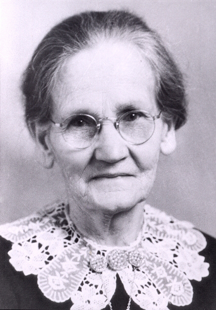

 Mary Ann Jollow restoration
Marry Ann Jollow born the 19th of Dec. 1862 to **Richard Jollow** and **Ann Gill**. 4th born of 8 children, she was the oldest daughter. She was born in Common Moor, Saint Cleer, Cornwall, England.
She married [**Charles Stone**](/people/charles-stone/) on November 15th 1879. Two years after he had left for Pennsylvania with his brother Augustine (his name might have been Henry still researching) St. Clair Stone to work in the Pennsylvania mines in 1877. Had they made some real money, Charles and Mary Ann might never have met. Not sure if Charles new the Jollows before leaving for America, but at some point he met Marry Ann Jollow and fell in love. They were married in Pontypridd, Glamorgan Wales.
I (Steve T. Stone) have heard rumors that the Stone Family is related to the Tudor Dynasty in some way. I've found no documented links to these claims as of yet. However I do find it interesting that in Saint Cleer, Common moor, Cornwall England we find the Windsor House. I wonder if the Tudor line comes from the Jollow or Gill side of the family? Looking at the **[map](https://maps.google.com/maps?q=Common+Moor,+Saint+Cleer,+Cornwall,+England,+United+Kingdom&hl=en&ll=50.487323,-4.469697&spn=0.005318,0.009538&sll=50.495248,-4.480791&sspn=0.042534,0.076303&t=h&hnear=Common+Moor,+Cornwall,+United+Kingdom&z=17)**, I also see many streets named Penhale, which is the maiden name of Mary Ann's Great Great Grandmother **Mary Penhale** and 3 times great Grandfather **Richard Penhale** from Thornburry, Devonshire England just 30 miles N.E of Saint Cleer. I wonder if they had some stake in Saint Cleer that we aren't aware of, or if it's just a coincidence.

## Children

Marry Ann Jollow was the mother of 13 children. Living in Llantrisant, Glamorgan, Wales she had her 1st Child **Henry St. Clair Stone** 23 Aug. 1880 exactly 9 months and 8 days after her wedding. Her 2nd Child **Richard John Stone** 16 Oct. 1881 born just 14 months later. I imagine his as a family historian, he's responsible for some of the Biographies you'll find on this site. **William Charles Stone** 26 Mar. 1883 was the 3rd born just 17 months later. **Frederick James Stone** 26 Sep. 1884 the 4th child born only 18 months after William Charles. **Alfred George Stone** 16 April 1886 was the 5th child and son born, 19 moths later. The had their 1st girl the 6th child **Ethel Ann Stone** on 3 Dec. 1889 3 year and 8 months after Alfred. 13 moths later she had another daughter the 7th born, **Alice Elizabeth Stone** 4 Jan, 1891. Two years and 4 months later, the 3rd daughter in a row and the 8th child born was **Susanna Gertrude Stone** 15 May 1893. **Lucy Henrietta Stone** was the 9th child born almost exactly 3 years after Susanna on 18 Mar. 1896 she was the 4th daughter. **Glenville Jollow Stone** born on 5 Aug. 1898 just 1 year and 8 months before his father would jump on the S.S. Ethiopia from Glasgow Scotland to New York, USA. The 1st and only child of Charles Stone and Mary Ann Jollow born in the United States was **Ivor Tudor Stone** 12 July 1901 the 11th child, born just 8 months after the family arrived in Utah. The 12th child and 1st born in Alberta, Raymond Canada was **Lawrence Edward Stone** 29 July 1904. The 13th and final child born was **Eugene Vivian Stone** 24 Jan. 1906 in Raymond, Alberta, Canada.

## The New Country

Mary Ann and her remaining children sailed to the United States on 30 Aug. 1900 on the S.S. New England from Liverpool, England to New York, arriving 6 Oct. 1900. They travelled by train to meet Charles in Utah. There in Grass Creek they had Ivor Tudor Stone. A short while later they moved to Raymond Albert Canada where they had a farm. The last two children where born there, Lawrence and Eugene (Gene).
